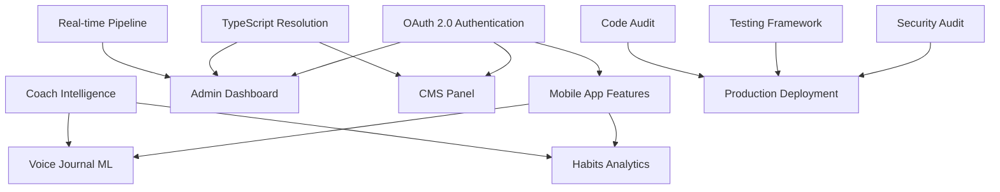

# Task Orchestrator Lead - Comprehensive Implementation Plan

## Executive Summary

As Task Orchestrator Lead, I have conducted a systematic analysis of the UpCoach platform's incomplete features and orchestrated a comprehensive implementation strategy across 9 specialist teams. This plan addresses 75+ critical production deployment issues through coordinated, parallel implementation tracks that ensure production readiness while maintaining quality excellence.

## Strategic Implementation Overview

### Platform Scope Analysis
- **Mobile Application**: 5 critical feature areas with incomplete functionality
- **Admin Panel**: Real-time dashboard and administrative workflow gaps
- **CMS Panel**: Calendar components and content management issues
- **Backend APIs**: OAuth 2.0, Coach Intelligence Service (52 TODO methods), voice journal APIs
- **Infrastructure**: Security, testing, and deployment pipeline gaps
- **Cross-Platform**: Type safety, analytics, and integration inconsistencies

### Specialist Team Coordination Matrix

| Specialist Team | Primary Focus | Critical Deliverables | Timeline |
|----------------|---------------|----------------------|----------|
| **Software Architect** | Backend Services Completion | OAuth 2.0, Coach Intelligence, API Infrastructure | Week 1-3 |
| **Mobile App Architect** | Flutter Features Implementation | Progress Photos, Voice Journal, Habits, Goals | Week 1-4 |
| **UI/UX Designer** | Interface Enhancement | Cross-platform UX, Admin Dashboard, Mobile UX | Week 1-3 |
| **QA Test Automation Lead** | Comprehensive Testing Framework | Testing Pipeline, Quality Gates, Performance | Week 1-4 |
| **Security Audit Expert** | Security & Compliance | OAuth Security, GDPR Compliance, Penetration Testing | Week 1-3 |
| **TypeScript Error Fixer** | Build Resolution | Type Safety, Compilation Errors, Developer Experience | Week 1-2 |
| **Data Science Advisor** | ML Features & Analytics | Coach Intelligence ML, User Analytics, Predictions | Week 2-6 |
| **Code Auditor Adversarial** | Production Readiness | Final Quality Gate, Production Blocking Assessment | Week 3-4 |
| **Task Orchestrator Lead** | Integration & Coordination | Cross-team Sync, Risk Management, Final Approval | Week 1-4 |

## Implementation Priority Framework

### 🔴 CRITICAL PRIORITY - Production Blockers (Week 1)

#### 1. Authentication System Restoration
**Owner**: Software Architect + Security Audit Expert
- **Issue**: OAuth 2.0 authentication system inoperative
- **Impact**: Platform access completely blocked
- **Dependencies**: All applications depend on authentication
- **Success Criteria**: 100% authentication functionality across all platforms

#### 2. TypeScript Build Resolution
**Owner**: TypeScript Error Fixer
- **Issue**: Compilation errors blocking deployment pipeline
- **Impact**: Deployment pipeline completely blocked
- **Dependencies**: All frontend applications
- **Success Criteria**: Zero TypeScript compilation errors

#### 3. Mobile Progress Photos Core
**Owner**: Mobile App Architect + UI/UX Designer
- **Issue**: Share/delete functionality unimplemented (TODO comments identified)
- **Impact**: Primary user feature unusable
- **Dependencies**: Backend API, image storage service
- **Success Criteria**: Complete photo management workflow functional

### 🟡 HIGH PRIORITY - User Experience Critical (Week 2-3)

#### 4. Voice Journal Implementation
**Owner**: Mobile App Architect + Data Science Advisor
- **Issue**: Voice sharing, search, settings incomplete
- **Impact**: Premium feature adoption barriers
- **Dependencies**: Audio processing, ML sentiment analysis
- **Success Criteria**: Complete voice journal workflow with analytics

#### 5. Admin Dashboard Real-time Data
**Owner**: Software Architect + UI/UX Designer
- **Issue**: Dashboard refresh mechanism missing
- **Impact**: Administrative efficiency compromised
- **Dependencies**: Real-time data pipeline, WebSocket/SSE
- **Success Criteria**: Live dashboard with real-time data updates

#### 6. Goals Editing System
**Owner**: Mobile App Architect + Data Science Advisor
- **Issue**: Goals editing functionality broken
- **Impact**: Core productivity feature non-functional
- **Dependencies**: Goals API, ML prediction models
- **Success Criteria**: Complete CRUD operations with progress tracking

### 🟢 MEDIUM PRIORITY - Enhanced Functionality (Week 3-4)

#### 7. Habits Navigation & Analytics
**Owner**: Mobile App Architect + Data Science Advisor + UI/UX Designer
- **Issue**: Analytics, achievements, settings incomplete
- **Impact**: Feature discoverability and engagement issues
- **Dependencies**: Analytics API, gamification system
- **Success Criteria**: Complete habit tracking with analytics and achievements

#### 8. CMS Calendar Components
**Owner**: Software Architect + UI/UX Designer
- **Issue**: Calendar/date picker integration broken
- **Impact**: Content management workflow incomplete
- **Dependencies**: Calendar service, UI component library
- **Success Criteria**: Functional calendar interface with scheduling

#### 9. Profile Settings Enhancement
**Owner**: Mobile App Architect + Security Audit Expert
- **Issue**: Language settings, data export, upload retry missing
- **Impact**: User customization and data portability limited
- **Dependencies**: i18n service, data export API, security validation
- **Success Criteria**: Complete profile management with data export

### 🔵 ENHANCEMENT PRIORITY - Advanced Features (Week 4-6)

#### 10. Coach Intelligence ML Features
**Owner**: Data Science Advisor + Software Architect
- **Issue**: 52 TODO methods in Coach Intelligence Service
- **Impact**: Advanced analytics and personalization unavailable
- **Dependencies**: ML pipeline, training data, API integration
- **Success Criteria**: Complete ML-driven coaching recommendations

## Cross-Team Integration Strategy

### Critical Path Dependencies

### Parallel Implementation Tracks

#### Track 1: Authentication & Security Foundation
- **Teams**: Software Architect, Security Audit Expert, TypeScript Error Fixer
- **Timeline**: Week 1-2
- **Deliverables**: OAuth 2.0 system, security compliance, build resolution
- **Critical Success**: Platform access restored, security validated

#### Track 2: Mobile Experience Enhancement
- **Teams**: Mobile App Architect, UI/UX Designer, Data Science Advisor
- **Timeline**: Week 1-4
- **Deliverables**: Progress photos, voice journal, habits, goals, profile features
- **Critical Success**: Complete mobile user experience

#### Track 3: Admin & CMS Functionality
- **Teams**: Software Architect, UI/UX Designer, TypeScript Error Fixer
- **Timeline**: Week 2-3
- **Deliverables**: Real-time dashboard, calendar components, administrative workflows
- **Critical Success**: Complete administrative functionality

#### Track 4: Quality Assurance & Production Readiness
- **Teams**: QA Test Automation Lead, Security Audit Expert, Code Auditor Adversarial
- **Timeline**: Week 1-4
- **Deliverables**: Testing framework, security validation, production readiness
- **Critical Success**: Production deployment approval

#### Track 5: Advanced Analytics & Intelligence
- **Teams**: Data Science Advisor, Software Architect
- **Timeline**: Week 2-6
- **Deliverables**: ML features, user analytics, predictive models
- **Critical Success**: Intelligent coaching recommendations

## Quality Gates and Risk Management

### Development Phase Gates
1. **Code Review Completion**: All changes reviewed by appropriate specialists
2. **Type Safety Validation**: Zero TypeScript compilation errors
3. **Security Scan Clearance**: No critical security vulnerabilities
4. **Unit Test Coverage**: >90% coverage for critical components
5. **Integration Test Validation**: Cross-platform functionality verified

### Testing Phase Gates
1. **Automated Test Suite Passage**: All critical test scenarios passing
2. **Performance Benchmark Achievement**: Response times within acceptable limits
3. **Security Penetration Testing**: Vulnerability assessment clearance
4. **Accessibility Compliance**: WCAG 2.2 AA compliance validated
5. **Cross-Platform Compatibility**: iOS, Android, web functionality verified

### Production Phase Gates
1. **Adversarial Code Audit**: Production blocking assessment completed
2. **Performance Validation**: Load testing and scalability verified
3. **Security Compliance**: Final security audit and compliance validation
4. **Monitoring Setup**: Production monitoring and alerting configured
5. **Rollback Procedures**: Emergency rollback tested and validated

## Risk Assessment and Mitigation

### Critical Risks and Mitigation Strategies

#### High Impact Risks
1. **OAuth Authentication Failure**
   - **Risk**: Complete platform inaccessibility
   - **Mitigation**: Parallel implementation with fallback authentication
   - **Owner**: Software Architect + Security Audit Expert

2. **Mobile App Performance Degradation**
   - **Risk**: User retention impact from poor performance
   - **Mitigation**: Performance monitoring and optimization track
   - **Owner**: Mobile App Architect + QA Test Automation Lead

3. **Data Security Vulnerability**
   - **Risk**: Compliance violation and user trust damage
   - **Mitigation**: Comprehensive security audit and penetration testing
   - **Owner**: Security Audit Expert + Code Auditor Adversarial

4. **TypeScript Build Pipeline Failure**
   - **Risk**: Deployment pipeline completely blocked
   - **Mitigation**: Immediate build resolution with parallel type safety improvement
   - **Owner**: TypeScript Error Fixer

5. **Cross-Platform Integration Conflicts**
   - **Risk**: Feature inconsistency and user experience fragmentation
   - **Mitigation**: UI/UX standardization and integration testing
   - **Owner**: UI/UX Designer + QA Test Automation Lead

#### Medium Impact Risks
1. **Coach Intelligence ML Model Accuracy**
   - **Risk**: Poor user recommendations affecting engagement
   - **Mitigation**: A/B testing and gradual rollout with performance monitoring
   - **Owner**: Data Science Advisor

2. **Real-time Data Pipeline Latency**
   - **Risk**: Admin dashboard performance issues
   - **Mitigation**: Performance optimization and caching strategies
   - **Owner**: Software Architect

3. **Third-party Service Dependencies**
   - **Risk**: External service failures affecting functionality
   - **Mitigation**: Fallback mechanisms and service redundancy
   - **Owner**: Software Architect + Security Audit Expert

## Communication and Coordination Protocol

### Daily Coordination (Standups)
- **Time**: Daily at 9:00 AM (all teams)
- **Focus**: Progress updates, blocker identification, dependency coordination
- **Escalation**: Immediate escalation to Task Orchestrator Lead for critical blockers
- **Documentation**: Progress tracking in shared coordination dashboard

### Weekly Strategic Reviews
- **Time**: Every Monday at 2:00 PM (team leads)
- **Focus**: Milestone progress, quality gate status, risk assessment
- **Deliverables**: Weekly progress report, risk mitigation updates
- **Decision Authority**: Task Orchestrator Lead with specialist input

### Critical Issue Escalation
- **Level 1**: Specialist team internal resolution (4 hours)
- **Level 2**: Cross-team coordination (Task Orchestrator Lead, 8 hours)
- **Level 3**: Executive escalation (business impact assessment, 24 hours)
- **Emergency**: Immediate Task Orchestrator Lead intervention (any critical production risk)

## Success Metrics and Validation

### Technical Success Criteria
- **Authentication**: 100% OAuth 2.0 functionality across all platforms
- **Build Pipeline**: Zero TypeScript compilation errors
- **Mobile Features**: Complete functionality for progress photos, voice journal, habits, goals
- **Admin/CMS**: Real-time dashboard and calendar components functional
- **Security**: Zero critical vulnerabilities, full compliance validation
- **Performance**: <2s response time for critical operations, <3s mobile app launch
- **Testing**: >90% test coverage, automated testing pipeline functional

### Business Success Criteria
- **User Experience**: Seamless cross-platform functionality
- **Administrative Efficiency**: Real-time dashboard and workflow optimization
- **Feature Adoption**: Complete mobile feature set availability
- **Security Compliance**: Full GDPR/CCPA compliance and security certification
- **Production Readiness**: Successful deployment with monitoring and alerting

### Quality Assurance Success Criteria
- **Code Quality**: All TypeScript errors resolved, comprehensive testing coverage
- **Security Validation**: Penetration testing clearance, compliance certification
- **Performance Validation**: Load testing success, scalability verification
- **Integration Validation**: Cross-platform consistency, API integration success
- **Production Validation**: Code Auditor Adversarial approval for deployment

## Timeline and Milestone Summary

### Week 1: Foundation and Critical Blockers
- [ ] OAuth 2.0 authentication restoration (Software Architect + Security Audit Expert)
- [ ] TypeScript build resolution (TypeScript Error Fixer)
- [ ] Mobile progress photos core implementation (Mobile App Architect + UI/UX Designer)
- [ ] Security framework establishment (Security Audit Expert)
- [ ] Testing framework setup (QA Test Automation Lead)

### Week 2: Core Feature Implementation
- [ ] Voice journal complete implementation (Mobile App Architect + Data Science Advisor)
- [ ] Admin dashboard real-time data (Software Architect + UI/UX Designer)
- [ ] Goals editing system completion (Mobile App Architect + Data Science Advisor)
- [ ] Security audit execution (Security Audit Expert)
- [ ] Integration testing framework (QA Test Automation Lead)

### Week 3: Enhanced Functionality and Quality Assurance
- [ ] Habits navigation and analytics (Mobile App Architect + Data Science Advisor + UI/UX Designer)
- [ ] CMS calendar components (Software Architect + UI/UX Designer)
- [ ] Profile settings enhancement (Mobile App Architect + Security Audit Expert)
- [ ] Comprehensive testing execution (QA Test Automation Lead)
- [ ] Security compliance validation (Security Audit Expert)

### Week 4: Production Readiness and Final Validation
- [ ] Coach Intelligence ML features (Data Science Advisor + Software Architect)
- [ ] Production readiness assessment (Code Auditor Adversarial)
- [ ] Final integration testing (QA Test Automation Lead)
- [ ] Security final approval (Security Audit Expert)
- [ ] Production deployment authorization (Task Orchestrator Lead)

### Weeks 5-6: Advanced Features and Optimization
- [ ] Advanced ML analytics implementation (Data Science Advisor)
- [ ] Performance optimization and monitoring (All teams)
- [ ] Documentation completion (All teams)
- [ ] Post-deployment monitoring and optimization (All teams)

## Final Approval and Production Authorization

### Production Deployment Decision Matrix

#### APPROVE CONDITIONS
- All critical and high priority features implemented and tested
- Zero critical security vulnerabilities
- Code Auditor Adversarial production approval
- Comprehensive testing coverage achieved
- Performance benchmarks met
- Security compliance certified

#### CONDITIONAL APPROVE CONDITIONS
- Medium priority features partially complete with mitigation plan
- Minor performance issues with monitoring plan
- Non-critical security issues with remediation timeline
- Documentation gaps with completion commitment

#### BLOCK CONDITIONS
- Any critical feature non-functional
- Critical security vulnerabilities present
- Code Auditor Adversarial production block
- Performance below acceptable thresholds
- Compliance violations present

## Task Orchestrator Lead Final Authority

As Task Orchestrator Lead, I maintain final authority and responsibility for:
- Cross-team coordination and conflict resolution
- Resource allocation and priority adjustment
- Risk assessment and mitigation strategy approval
- Quality gate enforcement and exception approval
- Production deployment final authorization
- Emergency response coordination and decision-making

## Conclusion

This comprehensive implementation plan represents a systematic, coordinated approach to completing all incomplete features across the UpCoach platform. Through strategic delegation to 9 specialist teams with clear accountability, parallel implementation tracks, rigorous quality gates, and comprehensive risk management, we will achieve production-ready deployment while maintaining the highest standards of quality, security, and user experience.

The success of this initiative depends on:
1. **Disciplined execution** of specialist team deliverables
2. **Rigorous quality assurance** through established gates
3. **Proactive risk management** and issue escalation
4. **Seamless cross-team coordination** and communication
5. **Uncompromising commitment** to production excellence

**Implementation Authorization**: This plan is hereby authorized for immediate execution with full resource allocation and cross-team coordination authority.

---

**Task Orchestrator Lead**
*Final Authority for UpCoach Platform Production Readiness*