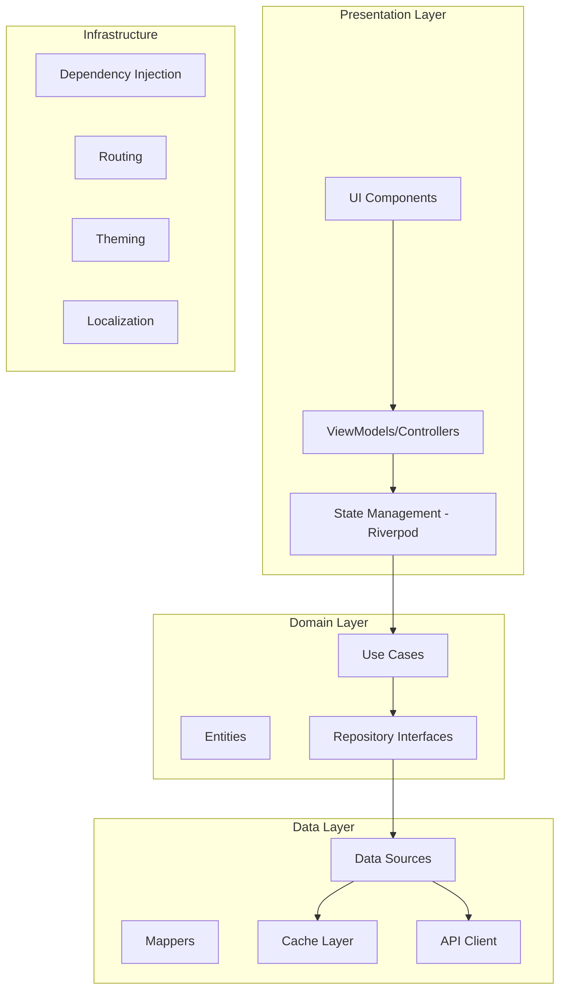

# UpCoach Mobile App Architecture - Flutter Implementation

## Executive Summary

This document outlines the comprehensive Flutter mobile app architecture for UpCoach, focusing on four key feature enhancements: Google Sign-In, Progress Photos, Voice Journal, and Profile Editing. The architecture emphasizes performance, offline-first capabilities, and seamless cross-platform compatibility.

## Table of Contents

1. [Architecture Overview](#architecture-overview)
2. [Project Structure](#project-structure)
3. [State Management Architecture](#state-management-architecture)
4. [Feature Implementations](#feature-implementations)
5. [Data Layer Architecture](#data-layer-architecture)
6. [UI/UX Architecture](#uiux-architecture)
7. [Testing Strategy](#testing-strategy)
8. [Performance Optimization](#performance-optimization)
9. [Security Implementation](#security-implementation)
10. [Platform-Specific Implementation](#platform-specific-implementation)

## Architecture Overview

### Core Principles



### Technology Stack

- **Framework**: Flutter 3.16+
- **State Management**: Riverpod 2.4+
- **Navigation**: GoRouter 12.1+
- **Networking**: Dio 5.3+ with Retrofit
- **Local Storage**: Hive for caching, SQLite for structured data
- **Authentication**: Firebase Auth + Custom JWT
- **Media Handling**: Image Picker, Record package for audio
- **Real-time**: WebSocket via web_socket_channel

## Project Structure

```
mobile-app/
├── lib/
│   ├── core/                      # Core functionality
│   │   ├── constants/             # App constants
│   │   ├── extensions/            # Dart extensions
│   │   ├── mixins/               # Reusable mixins
│   │   ├── networking/           # Network configuration
│   │   │   ├── api_client.dart
│   │   │   ├── interceptors/
│   │   │   └── websocket_manager.dart
│   │   ├── router/               # Navigation
│   │   │   ├── app_router.dart
│   │   │   ├── guards/
│   │   │   └── transitions/
│   │   ├── services/             # Core services
│   │   │   ├── auth_service.dart
│   │   │   ├── storage_service.dart
│   │   │   ├── media_service.dart
│   │   │   └── sync_service.dart
│   │   └── theme/                # Theming
│   │       ├── app_theme.dart
│   │       └── components/
│   │
│   ├── data/                     # Data layer
│   │   ├── datasources/
│   │   │   ├── local/
│   │   │   └── remote/
│   │   ├── models/               # Data models
│   │   ├── repositories/         # Repository implementations
│   │   └── sync/                 # Offline sync
│   │
│   ├── domain/                   # Business logic
│   │   ├── entities/
│   │   ├── repositories/         # Repository interfaces
│   │   └── usecases/
│   │
│   ├── features/                 # Feature modules
│   │   ├── auth/
│   │   │   ├── data/
│   │   │   ├── domain/
│   │   │   ├── presentation/
│   │   │   │   ├── providers/
│   │   │   │   ├── screens/
│   │   │   │   └── widgets/
│   │   │   └── google_signin/    # Google Sign-In specific
│   │   │       ├── google_auth_service.dart
│   │   │       └── google_signin_button.dart
│   │   │
│   │   ├── progress_photos/
│   │   │   ├── data/
│   │   │   │   ├── models/
│   │   │   │   └── repositories/
│   │   │   ├── domain/
│   │   │   └── presentation/
│   │   │       ├── providers/
│   │   │       ├── screens/
│   │   │       └── widgets/
│   │   │
│   │   ├── voice_journal/
│   │   │   ├── data/
│   │   │   ├── domain/
│   │   │   └── presentation/
│   │   │       ├── providers/
│   │   │       ├── screens/
│   │   │       └── widgets/
│   │   │
│   │   └── profile/
│   │       ├── data/
│   │       ├── domain/
│   │       └── presentation/
│   │
│   ├── shared/                   # Shared components
│   │   ├── models/
│   │   ├── providers/
│   │   ├── utils/
│   │   └── widgets/
│   │
│   └── main.dart                 # App entry point
│
├── test/                         # Unit tests
├── integration_test/             # Integration tests
└── pubspec.yaml
```

## State Management Architecture

### Riverpod Provider Architecture

```dart
// 1. Feature State Model
@freezed
class ProgressPhotosState with _$ProgressPhotosState {
  const factory ProgressPhotosState({
    @Default([]) List<ProgressPhoto> photos,
    @Default(false) bool isLoading,
    @Default(false) bool isSyncing,
    String? error,
    @Default({}) Map<String, UploadProgress> uploadProgress,
    @Default([]) List<String> selectedPhotos,
    SortOption? sortOption,
    FilterOptions? filters,
  }) = _ProgressPhotosState;
}

// 2. State Notifier
class ProgressPhotosNotifier extends StateNotifier<ProgressPhotosState> {
  final ProgressPhotosRepository _repository;
  final MediaService _mediaService;
  final SyncService _syncService;
  
  ProgressPhotosNotifier({
    required ProgressPhotosRepository repository,
    required MediaService mediaService,
    required SyncService syncService,
  }) : _repository = repository,
       _mediaService = mediaService,
       _syncService = syncService,
       super(const ProgressPhotosState());

  // Complex async operation with optimistic updates
  Future<void> uploadPhoto(XFile imageFile) async {
    final tempId = const Uuid().v4();
    final optimisticPhoto = ProgressPhoto(
      id: tempId,
      localPath: imageFile.path,
      status: PhotoStatus.uploading,
      createdAt: DateTime.now(),
    );

    // Optimistic update
    state = state.copyWith(
      photos: [...state.photos, optimisticPhoto],
      uploadProgress: {
        ...state.uploadProgress,
        tempId: UploadProgress(0, 0),
      },
    );

    try {
      // Compress image
      final compressed = await _mediaService.compressImage(
        imageFile,
        quality: 85,
        maxWidth: 1920,
      );

      // Upload with progress tracking
      final uploadedPhoto = await _repository.uploadPhoto(
        compressed,
        onProgress: (sent, total) {
          state = state.copyWith(
            uploadProgress: {
              ...state.uploadProgress,
              tempId: UploadProgress(sent, total),
            },
          );
        },
      );

      // Replace optimistic with real data
      state = state.copyWith(
        photos: state.photos.map((p) => 
          p.id == tempId ? uploadedPhoto : p
        ).toList(),
        uploadProgress: Map.from(state.uploadProgress)..remove(tempId),
      );

      // Trigger background sync
      await _syncService.syncPhoto(uploadedPhoto);
      
    } catch (e) {
      // Rollback optimistic update
      state = state.copyWith(
        photos: state.photos.where((p) => p.id != tempId).toList(),
        uploadProgress: Map.from(state.uploadProgress)..remove(tempId),
        error: 'Failed to upload photo: ${e.toString()}',
      );
    }
  }

  // Batch operations with offline support
  Future<void> deletePhotos(List<String> photoIds) async {
    // Mark for deletion locally
    state = state.copyWith(
      photos: state.photos.map((p) {
        if (photoIds.contains(p.id)) {
          return p.copyWith(status: PhotoStatus.pendingDeletion);
        }
        return p;
      }).toList(),
    );

    try {
      // Batch delete on server
      await _repository.batchDelete(photoIds);
      
      // Remove from local state
      state = state.copyWith(
        photos: state.photos.where((p) => !photoIds.contains(p.id)).toList(),
      );
    } catch (e) {
      if (e is NetworkException) {
        // Queue for later sync
        await _syncService.queueDeletion(photoIds);
      } else {
        // Rollback
        state = state.copyWith(
          photos: state.photos.map((p) {
            if (photoIds.contains(p.id)) {
              return p.copyWith(status: PhotoStatus.active);
            }
            return p;
          }).toList(),
          error: 'Failed to delete photos',
        );
      }
    }
  }
}

// 3. Provider Definition
final progressPhotosProvider = 
    StateNotifierProvider<ProgressPhotosNotifier, ProgressPhotosState>((ref) {
  return ProgressPhotosNotifier(
    repository: ref.watch(progressPhotosRepositoryProvider),
    mediaService: ref.watch(mediaServiceProvider),
    syncService: ref.watch(syncServiceProvider),
  );
});

// 4. Computed Providers
final sortedPhotosProvider = Provider<List<ProgressPhoto>>((ref) {
  final state = ref.watch(progressPhotosProvider);
  final photos = [...state.photos];
  
  switch (state.sortOption) {
    case SortOption.dateNewest:
      photos.sort((a, b) => b.createdAt.compareTo(a.createdAt));
      break;
    case SortOption.dateOldest:
      photos.sort((a, b) => a.createdAt.compareTo(b.createdAt));
      break;
    case SortOption.category:
      photos.sort((a, b) => a.category.compareTo(b.category));
      break;
    default:
      break;
  }
  
  return photos;
});
```

### WebSocket State Management

```dart
// Real-time updates via WebSocket
class VoiceJournalWebSocketNotifier extends StateNotifier<VoiceJournalState> {
  late final WebSocketChannel _channel;
  StreamSubscription? _subscription;
  
  VoiceJournalWebSocketNotifier() : super(const VoiceJournalState()) {
    _initWebSocket();
  }
  
  void _initWebSocket() {
    _channel = WebSocketChannel.connect(
      Uri.parse('wss://api.upcoach.ai/ws/voice-journal'),
    );
    
    _subscription = _channel.stream.listen(
      _handleWebSocketMessage,
      onError: _handleWebSocketError,
      onDone: _handleWebSocketDone,
    );
  }
  
  void _handleWebSocketMessage(dynamic message) {
    final data = jsonDecode(message);
    
    switch (data['type']) {
      case 'transcription_complete':
        _updateTranscription(data['payload']);
        break;
      case 'processing_progress':
        _updateProgress(data['payload']);
        break;
      case 'processing_error':
        _handleProcessingError(data['payload']);
        break;
    }
  }
  
  void _updateTranscription(Map<String, dynamic> payload) {
    final journalId = payload['journal_id'];
    final transcription = payload['transcription'];
    
    state = state.copyWith(
      journals: state.journals.map((j) {
        if (j.id == journalId) {
          return j.copyWith(
            transcription: transcription,
            status: JournalStatus.completed,
          );
        }
        return j;
      }).toList(),
    );
  }
  
  @override
  void dispose() {
    _subscription?.cancel();
    _channel.sink.close();
    super.dispose();
  }
}
```

## Feature Implementations

### 1. Google Sign-In Integration

```dart
// google_auth_service.dart
class GoogleAuthService {
  final GoogleSignIn _googleSignIn;
  final AuthRepository _authRepository;
  final SecureStorage _secureStorage;
  
  GoogleAuthService({
    required AuthRepository authRepository,
    required SecureStorage secureStorage,
  }) : _googleSignIn = GoogleSignIn(
         scopes: ['email', 'profile'],
         clientId: Platform.isIOS 
           ? Env.googleClientIdIOS 
           : null, // Android uses google-services.json
       ),
       _authRepository = authRepository,
       _secureStorage = secureStorage;

  Future<AuthResult> signInWithGoogle() async {
    try {
      // Platform-specific handling
      if (Platform.isIOS) {
        await _handleIOSSignIn();
      }
      
      // Trigger sign-in flow
      final GoogleSignInAccount? account = await _googleSignIn.signIn();
      
      if (account == null) {
        throw AuthException('User cancelled Google Sign-In');
      }
      
      // Get authentication tokens
      final GoogleSignInAuthentication auth = await account.authentication;
      
      // Validate tokens
      if (auth.idToken == null || auth.accessToken == null) {
        throw AuthException('Failed to obtain Google tokens');
      }
      
      // Send to backend for verification
      final authResult = await _authRepository.authenticateWithGoogle(
        idToken: auth.idToken!,
        accessToken: auth.accessToken!,
        userInfo: GoogleUserInfo(
          id: account.id,
          email: account.email,
          displayName: account.displayName,
          photoUrl: account.photoUrl,
        ),
      );
      
      // Store tokens securely
      await _secureStorage.saveTokens(
        accessToken: authResult.accessToken,
        refreshToken: authResult.refreshToken,
      );
      
      // Store Google sign-in state
      await _secureStorage.setValue('google_signed_in', 'true');
      
      return authResult;
      
    } on PlatformException catch (e) {
      throw _handlePlatformException(e);
    } catch (e) {
      // Ensure clean state on error
      await _googleSignIn.signOut();
      rethrow;
    }
  }
  
  Future<void> _handleIOSSignIn() async {
    // iOS-specific: Check for previous sign-in
    final bool isSignedIn = await _googleSignIn.isSignedIn();
    if (isSignedIn) {
      // Sign out to ensure fresh authentication
      await _googleSignIn.signOut();
    }
  }
  
  AuthException _handlePlatformException(PlatformException e) {
    switch (e.code) {
      case 'sign_in_failed':
        return AuthException('Google Sign-In failed: ${e.message}');
      case 'network_error':
        return NetworkException('Network error during sign-in');
      case 'sign_in_cancelled':
        return AuthException('Sign-in was cancelled');
      default:
        return AuthException('Unknown error: ${e.code}');
    }
  }
}

// Google Sign-In Button Widget
class GoogleSignInButton extends ConsumerWidget {
  final VoidCallback? onSuccess;
  
  const GoogleSignInButton({this.onSuccess, super.key});
  
  @override
  Widget build(BuildContext context, WidgetRef ref) {
    final authState = ref.watch(authStateProvider);
    
    return Material(
      elevation: 2,
      borderRadius: BorderRadius.circular(8),
      child: InkWell(
        onTap: authState.isLoading 
          ? null 
          : () => _handleGoogleSignIn(context, ref),
        borderRadius: BorderRadius.circular(8),
        child: Container(
          height: 56,
          padding: const EdgeInsets.symmetric(horizontal: 16),
          decoration: BoxDecoration(
            border: Border.all(color: Colors.grey.shade300),
            borderRadius: BorderRadius.circular(8),
          ),
          child: Row(
            mainAxisAlignment: MainAxisAlignment.center,
            children: [
              if (authState.isLoading)
                const SizedBox(
                  width: 20,
                  height: 20,
                  child: CircularProgressIndicator(strokeWidth: 2),
                )
              else
                SvgPicture.asset(
                  'assets/icons/google_logo.svg',
                  width: 24,
                  height: 24,
                ),
              const SizedBox(width: 12),
              Text(
                authState.isLoading 
                  ? 'Signing in...' 
                  : 'Continue with Google',
                style: Theme.of(context).textTheme.titleMedium,
              ),
            ],
          ),
        ),
      ),
    );
  }
  
  Future<void> _handleGoogleSignIn(BuildContext context, WidgetRef ref) async {
    try {
      await ref.read(authStateProvider.notifier).signInWithGoogle();
      onSuccess?.call();
    } catch (e) {
      if (context.mounted) {
        ScaffoldMessenger.of(context).showSnackBar(
          SnackBar(
            content: Text(_getErrorMessage(e)),
            backgroundColor: Colors.red,
          ),
        );
      }
    }
  }
  
  String _getErrorMessage(dynamic error) {
    if (error is AuthException) {
      return error.message;
    } else if (error is NetworkException) {
      return 'Network error. Please check your connection.';
    }
    return 'An unexpected error occurred';
  }
}
```

### 2. Progress Photos Enhancement

```dart
// Progress Photos Repository with S3 Integration
class ProgressPhotosRepositoryImpl implements ProgressPhotosRepository {
  final ApiClient _apiClient;
  final LocalDatabase _localDb;
  final S3Service _s3Service;
  
  @override
  Future<ProgressPhoto> uploadPhoto(
    File imageFile, {
    Function(int, int)? onProgress,
  }) async {
    // 1. Get pre-signed URL from backend
    final presignedData = await _apiClient.getPresignedUploadUrl(
      filename: path.basename(imageFile.path),
      contentType: 'image/jpeg',
    );
    
    // 2. Upload directly to S3 with progress
    await _s3Service.uploadWithProgress(
      presignedData.url,
      imageFile,
      headers: presignedData.headers,
      onProgress: onProgress,
    );
    
    // 3. Confirm upload with backend
    final photo = await _apiClient.confirmPhotoUpload(
      uploadId: presignedData.uploadId,
      metadata: PhotoMetadata(
        takenAt: DateTime.now(),
        deviceInfo: await DeviceInfo.get(),
      ),
    );
    
    // 4. Cache locally for offline access
    await _localDb.cachePhoto(photo);
    
    return photo;
  }
  
  @override
  Future<void> sharePhotos(
    List<String> photoIds, 
    ShareMethod method,
  ) async {
    // Generate share package based on method
    final shareData = await _apiClient.preparePhotoShare(
      photoIds: photoIds,
      method: method,
      options: ShareOptions(
        includeMetadata: true,
        generatePdf: method == ShareMethod.pdf,
        compressImages: method == ShareMethod.socialMedia,
      ),
    );
    
    // Platform-specific sharing
    if (Platform.isIOS) {
      await _shareViaActivitySheet(shareData);
    } else {
      await _shareViaIntent(shareData);
    }
  }
}

// Enhanced Photo Gallery Widget
class PhotoGalleryWidget extends ConsumerStatefulWidget {
  @override
  _PhotoGalleryWidgetState createState() => _PhotoGalleryWidgetState();
}

class _PhotoGalleryWidgetState extends ConsumerState<PhotoGalleryWidget> {
  final ScrollController _scrollController = ScrollController();
  bool _isSelectionMode = false;
  
  @override
  Widget build(BuildContext context) {
    final photos = ref.watch(sortedPhotosProvider);
    final selectedPhotos = ref.watch(selectedPhotosProvider);
    
    return Scaffold(
      body: CustomScrollView(
        controller: _scrollController,
        slivers: [
          // Collapsible header with filters
          SliverAppBar(
            expandedHeight: 200,
            floating: true,
            pinned: true,
            flexibleSpace: FlexibleSpaceBar(
              title: Text('Progress Photos'),
              background: _buildHeaderStats(photos),
            ),
            actions: [
              if (_isSelectionMode) ...[
                IconButton(
                  icon: Icon(Icons.share),
                  onPressed: selectedPhotos.isNotEmpty 
                    ? () => _shareSelected() 
                    : null,
                ),
                IconButton(
                  icon: Icon(Icons.delete),
                  onPressed: selectedPhotos.isNotEmpty 
                    ? () => _deleteSelected() 
                    : null,
                ),
              ],
              IconButton(
                icon: Icon(_isSelectionMode ? Icons.close : Icons.check_circle),
                onPressed: () => setState(() {
                  _isSelectionMode = !_isSelectionMode;
                  if (!_isSelectionMode) {
                    ref.read(progressPhotosProvider.notifier).clearSelection();
                  }
                }),
              ),
            ],
          ),
          
          // Photo grid with animations
          SliverPadding(
            padding: EdgeInsets.all(8),
            sliver: SliverGrid(
              gridDelegate: SliverGridDelegateWithFixedCrossAxisCount(
                crossAxisCount: _calculateCrossAxisCount(context),
                crossAxisSpacing: 8,
                mainAxisSpacing: 8,
              ),
              delegate: SliverChildBuilderDelegate(
                (context, index) {
                  final photo = photos[index];
                  final isSelected = selectedPhotos.contains(photo.id);
                  
                  return PhotoTile(
                    photo: photo,
                    isSelectionMode: _isSelectionMode,
                    isSelected: isSelected,
                    onTap: () => _handlePhotoTap(photo),
                    onLongPress: () => _handlePhotoLongPress(photo),
                  );
                },
                childCount: photos.length,
              ),
            ),
          ),
        ],
      ),
      floatingActionButton: _buildFAB(),
    );
  }
  
  int _calculateCrossAxisCount(BuildContext context) {
    final width = MediaQuery.of(context).size.width;
    if (width > 600) return 4;
    if (width > 400) return 3;
    return 2;
  }
}
```

### 3. Voice Journal with Audio Processing

```dart
// Voice Recording Service with Advanced Features
class VoiceRecordingService {
  final Record _audioRecorder = Record();
  final AudioPlayer _audioPlayer = AudioPlayer();
  StreamController<RecordingState>? _recordingStateController;
  Timer? _durationTimer;
  String? _currentRecordingPath;
  
  Stream<RecordingState> get recordingState => 
    _recordingStateController?.stream ?? Stream.empty();
  
  Future<void> startRecording({
    required String sessionId,
    AudioQuality quality = AudioQuality.high,
  }) async {
    // Check permissions
    if (!await _audioRecorder.hasPermission()) {
      final permission = await Permission.microphone.request();
      if (!permission.isGranted) {
        throw RecordingException('Microphone permission denied');
      }
    }
    
    // Setup recording path
    final directory = await getApplicationDocumentsDirectory();
    _currentRecordingPath = '${directory.path}/voice_journal_$sessionId.m4a';
    
    // Configure encoder based on platform
    final encoder = Platform.isIOS 
      ? AudioEncoder.aacHe 
      : AudioEncoder.aacLc;
    
    // Start recording with quality settings
    await _audioRecorder.start(
      path: _currentRecordingPath!,
      encoder: encoder,
      bitRate: quality == AudioQuality.high ? 128000 : 64000,
      samplingRate: 44100,
    );
    
    // Start duration tracking
    _startDurationTimer();
    
    // Emit recording state
    _recordingStateController?.add(RecordingState.recording);
  }
  
  Future<RecordingResult> stopRecording() async {
    final path = await _audioRecorder.stop();
    _durationTimer?.cancel();
    
    if (path == null) {
      throw RecordingException('Recording failed');
    }
    
    // Get recording metadata
    final file = File(path);
    final duration = await _getAudioDuration(path);
    final fileSize = await file.length();
    
    // Generate waveform data
    final waveform = await _generateWaveform(path);
    
    _recordingStateController?.add(RecordingState.stopped);
    
    return RecordingResult(
      path: path,
      duration: duration,
      fileSize: fileSize,
      waveform: waveform,
    );
  }
  
  Future<List<double>> _generateWaveform(String audioPath) async {
    // Use audio_waveforms package for waveform generation
    final controller = PlayerController();
    await controller.preparePlayer(path: audioPath);
    
    final waveformData = await controller.extractWaveformData(
      path: audioPath,
      noOfSamples: 100,
    );
    
    controller.dispose();
    return waveformData;
  }
  
  // Voice-to-text processing
  Future<TranscriptionResult> transcribeAudio(String audioPath) async {
    final file = File(audioPath);
    final bytes = await file.readAsBytes();
    
    // Upload to backend for processing
    final response = await _apiClient.uploadAudioForTranscription(
      audioBytes: bytes,
      filename: path.basename(audioPath),
    );
    
    // Return job ID for status tracking
    return TranscriptionResult(
      jobId: response.jobId,
      status: TranscriptionStatus.processing,
    );
  }
}

// Voice Journal UI with Waveform Visualization
class VoiceRecordingWidget extends ConsumerStatefulWidget {
  @override
  _VoiceRecordingWidgetState createState() => _VoiceRecordingWidgetState();
}

class _VoiceRecordingWidgetState extends ConsumerState<VoiceRecordingWidget>
    with TickerProviderStateMixin {
  late AnimationController _pulseController;
  late AnimationController _waveController;
  
  @override
  void initState() {
    super.initState();
    _pulseController = AnimationController(
      duration: Duration(seconds: 2),
      vsync: this,
    )..repeat(reverse: true);
    
    _waveController = AnimationController(
      duration: Duration(milliseconds: 500),
      vsync: this,
    );
  }
  
  @override
  Widget build(BuildContext context) {
    final recordingState = ref.watch(voiceRecordingProvider);
    
    return Column(
      children: [
        // Recording indicator with animation
        if (recordingState.isRecording)
          _buildRecordingIndicator(),
        
        // Waveform visualization
        if (recordingState.waveform != null)
          WaveformWidget(
            waveform: recordingState.waveform!,
            isPlaying: recordingState.isPlaying,
            progress: recordingState.playbackProgress,
          ),
        
        // Recording controls
        _buildRecordingControls(recordingState),
        
        // Transcription display
        if (recordingState.transcription != null)
          _buildTranscriptionCard(recordingState.transcription!),
      ],
    );
  }
  
  Widget _buildRecordingIndicator() {
    return AnimatedBuilder(
      animation: _pulseController,
      builder: (context, child) {
        return Container(
          width: 200,
          height: 200,
          decoration: BoxDecoration(
            shape: BoxShape.circle,
            color: Colors.red.withOpacity(0.1),
            boxShadow: [
              BoxShadow(
                color: Colors.red.withOpacity(_pulseController.value * 0.3),
                blurRadius: 20 * _pulseController.value,
                spreadRadius: 10 * _pulseController.value,
              ),
            ],
          ),
          child: Center(
            child: Icon(
              Icons.mic,
              size: 80,
              color: Colors.red,
            ),
          ),
        );
      },
    );
  }
  
  Widget _buildRecordingControls(VoiceRecordingState state) {
    return Row(
      mainAxisAlignment: MainAxisAlignment.center,
      children: [
        // Play/Pause button
        if (state.hasRecording) ...[
          IconButton(
            iconSize: 48,
            icon: Icon(
              state.isPlaying ? Icons.pause_circle : Icons.play_circle,
            ),
            onPressed: () => _togglePlayback(),
          ),
          SizedBox(width: 24),
        ],
        
        // Record button
        GestureDetector(
          onLongPressStart: (_) => _startRecording(),
          onLongPressEnd: (_) => _stopRecording(),
          child: Container(
            width: 80,
            height: 80,
            decoration: BoxDecoration(
              shape: BoxShape.circle,
              color: state.isRecording ? Colors.red : Theme.of(context).primaryColor,
              boxShadow: [
                BoxShadow(
                  color: Colors.black26,
                  blurRadius: 8,
                  offset: Offset(0, 4),
                ),
              ],
            ),
            child: Icon(
              Icons.mic,
              size: 40,
              color: Colors.white,
            ),
          ),
        ),
        
        // Delete button
        if (state.hasRecording) ...[
          SizedBox(width: 24),
          IconButton(
            iconSize: 48,
            icon: Icon(Icons.delete_outline),
            onPressed: () => _deleteRecording(),
          ),
        ],
      ],
    );
  }
}
```

### 4. Profile Editing with Conflict Resolution

```dart
// Profile Service with Optimistic Locking
class ProfileService {
  final ApiClient _apiClient;
  final LocalCache _cache;
  final ConflictResolver _conflictResolver;
  
  Future<ProfileUpdateResult> updateProfile(
    ProfileData updates, {
    bool resolveConflicts = true,
  }) async {
    // Get current version from cache
    final currentProfile = await _cache.getProfile();
    final version = currentProfile?.version ?? 0;
    
    try {
      // Optimistic update in UI
      await _cache.updateProfile(updates.copyWith(
        version: version + 1,
        lastModified: DateTime.now(),
      ));
      
      // Send update to server with version
      final result = await _apiClient.updateProfile(
        updates: updates,
        currentVersion: version,
      );
      
      // Update cache with server response
      await _cache.updateProfile(result.profile);
      
      return ProfileUpdateResult.success(result.profile);
      
    } on VersionConflictException catch (e) {
      if (resolveConflicts) {
        return await _handleConflict(e, updates);
      } else {
        // Rollback optimistic update
        await _cache.updateProfile(currentProfile!);
        return ProfileUpdateResult.conflict(
          localData: updates,
          serverData: e.serverProfile,
        );
      }
    }
  }
  
  Future<ProfileUpdateResult> _handleConflict(
    VersionConflictException conflict,
    ProfileData localUpdates,
  ) async {
    // Automatic conflict resolution
    final resolution = await _conflictResolver.resolve(
      local: localUpdates,
      server: conflict.serverProfile,
      strategy: ConflictStrategy.mergeNonConflicting,
    );
    
    if (resolution.requiresUserInput) {
      return ProfileUpdateResult.requiresUserDecision(
        conflicts: resolution.conflicts,
        suggestions: resolution.suggestions,
      );
    }
    
    // Retry with merged data
    return updateProfile(
      resolution.mergedData,
      resolveConflicts: false,
    );
  }
}

// Profile Edit Form with Real-time Validation
class ProfileEditForm extends ConsumerStatefulWidget {
  @override
  _ProfileEditFormState createState() => _ProfileEditFormState();
}

class _ProfileEditFormState extends ConsumerState<ProfileEditForm> {
  final _formKey = GlobalKey<FormState>();
  final _debouncer = Debouncer(milliseconds: 500);
  late TextEditingController _nameController;
  late TextEditingController _bioController;
  
  @override
  Widget build(BuildContext context) {
    final profileState = ref.watch(profileProvider);
    
    return Form(
      key: _formKey,
      child: Column(
        children: [
          // Name field with real-time validation
          TextFormField(
            controller: _nameController,
            decoration: InputDecoration(
              labelText: 'Name',
              errorText: profileState.validationErrors['name'],
              suffixIcon: profileState.isValidating['name'] == true
                ? SizedBox(
                    width: 20,
                    height: 20,
                    child: CircularProgressIndicator(strokeWidth: 2),
                  )
                : profileState.validationErrors['name'] == null
                  ? Icon(Icons.check_circle, color: Colors.green)
                  : null,
            ),
            onChanged: (value) => _validateField('name', value),
            validator: (value) => _localValidation(value, 'name'),
          ),
          
          // Bio field with character counter
          TextFormField(
            controller: _bioController,
            maxLines: 4,
            maxLength: 500,
            decoration: InputDecoration(
              labelText: 'Bio',
              alignLabelWithHint: true,
              counterText: '${_bioController.text.length}/500',
            ),
            onChanged: (value) => _validateField('bio', value),
          ),
          
          // Avatar selection
          AvatarPicker(
            currentAvatar: profileState.profile?.avatarUrl,
            onAvatarChanged: (File? avatar) {
              ref.read(profileProvider.notifier).updateAvatar(avatar);
            },
          ),
          
          // Save button with loading state
          ElevatedButton(
            onPressed: profileState.isSaving ? null : _saveProfile,
            child: profileState.isSaving
              ? SizedBox(
                  width: 20,
                  height: 20,
                  child: CircularProgressIndicator(
                    strokeWidth: 2,
                    color: Colors.white,
                  ),
                )
              : Text('Save Changes'),
          ),
          
          // Conflict resolution UI
          if (profileState.hasConflict)
            ConflictResolutionCard(
              conflicts: profileState.conflicts!,
              onResolve: (resolution) {
                ref.read(profileProvider.notifier).resolveConflict(resolution);
              },
            ),
        ],
      ),
    );
  }
  
  void _validateField(String field, String value) {
    _debouncer.run(() {
      ref.read(profileProvider.notifier).validateField(field, value);
    });
  }
  
  Future<void> _saveProfile() async {
    if (_formKey.currentState?.validate() ?? false) {
      final result = await ref.read(profileProvider.notifier).saveProfile();
      
      if (result.isSuccess) {
        ScaffoldMessenger.of(context).showSnackBar(
          SnackBar(content: Text('Profile updated successfully')),
        );
      } else if (result.hasConflict) {
        _showConflictDialog(result.conflicts!);
      }
    }
  }
}
```

## Data Layer Architecture

### Repository Pattern with Caching

```dart
// Base Repository with Offline Support
abstract class BaseRepository<T> {
  final ApiClient apiClient;
  final LocalDatabase localDb;
  final SyncQueue syncQueue;
  
  BaseRepository({
    required this.apiClient,
    required this.localDb,
    required this.syncQueue,
  });
  
  Future<T?> getById(String id) async {
    try {
      // Try network first
      final remote = await apiClient.get<T>('/resource/$id');
      await localDb.save(remote);
      return remote;
    } catch (e) {
      // Fallback to cache
      final cached = await localDb.getById<T>(id);
      if (cached != null) {
        // Queue for background sync
        syncQueue.add(SyncTask(
          type: SyncType.fetch,
          resourceId: id,
        ));
      }
      return cached;
    }
  }
  
  Future<List<T>> getAll({
    int? limit,
    int? offset,
    Map<String, dynamic>? filters,
  }) async {
    try {
      final remote = await apiClient.getList<T>(
        '/resources',
        queryParams: {
          if (limit != null) 'limit': limit,
          if (offset != null) 'offset': offset,
          ...?filters,
        },
      );
      
      await localDb.saveAll(remote);
      return remote;
      
    } catch (e) {
      // Return cached with sync queue
      final cached = await localDb.getAll<T>(
        limit: limit,
        offset: offset,
        filters: filters,
      );
      
      if (cached.isNotEmpty) {
        syncQueue.add(SyncTask(
          type: SyncType.fetchList,
          filters: filters,
        ));
      }
      
      return cached;
    }
  }
}

// Sync Service for Offline-First
class SyncService {
  final SyncQueue _queue;
  final ConnectivityService _connectivity;
  Timer? _syncTimer;
  
  void startBackgroundSync() {
    _syncTimer = Timer.periodic(Duration(seconds: 30), (_) {
      if (_connectivity.isOnline) {
        _processSyncQueue();
      }
    });
    
    // Also sync on connectivity change
    _connectivity.onStatusChange.listen((status) {
      if (status == ConnectivityStatus.online) {
        _processSyncQueue();
      }
    });
  }
  
  Future<void> _processSyncQueue() async {
    final tasks = await _queue.getPendingTasks();
    
    for (final task in tasks) {
      try {
        await _processTask(task);
        await _queue.markComplete(task.id);
      } catch (e) {
        await _queue.markFailed(task.id, error: e.toString());
      }
    }
  }
}
```

### WebSocket Manager

```dart
class WebSocketManager {
  final Map<String, WebSocketChannel> _channels = {};
  final Map<String, StreamController> _controllers = {};
  
  Stream<T> subscribe<T>(String channel, String topic) {
    final key = '$channel:$topic';
    
    if (!_controllers.containsKey(key)) {
      _controllers[key] = StreamController<T>.broadcast();
      _connectToChannel(channel, topic);
    }
    
    return _controllers[key]!.stream as Stream<T>;
  }
  
  void _connectToChannel(String channel, String topic) {
    if (!_channels.containsKey(channel)) {
      final wsUrl = 'wss://api.upcoach.ai/ws/$channel';
      _channels[channel] = WebSocketChannel.connect(Uri.parse(wsUrl));
      
      _channels[channel]!.stream.listen(
        (message) => _handleMessage(channel, message),
        onError: (error) => _handleError(channel, error),
        onDone: () => _handleDisconnect(channel),
      );
    }
    
    // Subscribe to topic
    _channels[channel]!.sink.add(jsonEncode({
      'action': 'subscribe',
      'topic': topic,
    }));
  }
  
  void _handleMessage(String channel, dynamic message) {
    final data = jsonDecode(message);
    final topic = data['topic'];
    final key = '$channel:$topic';
    
    if (_controllers.containsKey(key)) {
      _controllers[key]!.add(data['payload']);
    }
  }
  
  void dispose() {
    for (final channel in _channels.values) {
      channel.sink.close();
    }
    for (final controller in _controllers.values) {
      controller.close();
    }
  }
}
```

## UI/UX Architecture

### Design System Implementation

```dart
// Theme Configuration
class AppTheme {
  static ThemeData lightTheme = ThemeData(
    useMaterial3: true,
    colorScheme: ColorScheme.fromSeed(
      seedColor: const Color(0xFF6366F1),
      brightness: Brightness.light,
    ),
    fontFamily: 'Poppins',
    elevatedButtonTheme: ElevatedButtonThemeData(
      style: ElevatedButton.styleFrom(
        minimumSize: const Size.fromHeight(56),
        shape: RoundedRectangleBorder(
          borderRadius: BorderRadius.circular(12),
        ),
      ),
    ),
    inputDecorationTheme: InputDecorationTheme(
      filled: true,
      fillColor: Colors.grey.shade50,
      border: OutlineInputBorder(
        borderRadius: BorderRadius.circular(12),
        borderSide: BorderSide.none,
      ),
      enabledBorder: OutlineInputBorder(
        borderRadius: BorderRadius.circular(12),
        borderSide: BorderSide(color: Colors.grey.shade300),
      ),
      focusedBorder: OutlineInputBorder(
        borderRadius: BorderRadius.circular(12),
        borderSide: BorderSide(color: const Color(0xFF6366F1), width: 2),
      ),
    ),
  );
  
  static ThemeData darkTheme = ThemeData(
    useMaterial3: true,
    colorScheme: ColorScheme.fromSeed(
      seedColor: const Color(0xFF6366F1),
      brightness: Brightness.dark,
    ),
    fontFamily: 'Poppins',
  );
}

// Responsive Layout Builder
class ResponsiveLayout extends StatelessWidget {
  final Widget mobile;
  final Widget? tablet;
  final Widget? desktop;
  
  const ResponsiveLayout({
    required this.mobile,
    this.tablet,
    this.desktop,
    super.key,
  });
  
  @override
  Widget build(BuildContext context) {
    return LayoutBuilder(
      builder: (context, constraints) {
        if (constraints.maxWidth >= 1200 && desktop != null) {
          return desktop!;
        } else if (constraints.maxWidth >= 768 && tablet != null) {
          return tablet!;
        }
        return mobile;
      },
    );
  }
}

// Custom Loading States
class ShimmerLoader extends StatelessWidget {
  final Widget child;
  
  const ShimmerLoader({required this.child, super.key});
  
  @override
  Widget build(BuildContext context) {
    return Shimmer.fromColors(
      baseColor: Colors.grey.shade300,
      highlightColor: Colors.grey.shade100,
      child: child,
    );
  }
}

// Error State Widget
class ErrorStateWidget extends StatelessWidget {
  final String message;
  final VoidCallback? onRetry;
  
  const ErrorStateWidget({
    required this.message,
    this.onRetry,
    super.key,
  });
  
  @override
  Widget build(BuildContext context) {
    return Center(
      child: Column(
        mainAxisAlignment: MainAxisAlignment.center,
        children: [
          Lottie.asset(
            'assets/animations/error.json',
            width: 200,
            height: 200,
          ),
          const SizedBox(height: 24),
          Text(
            'Oops! Something went wrong',
            style: Theme.of(context).textTheme.headlineSmall,
          ),
          const SizedBox(height: 8),
          Text(
            message,
            style: Theme.of(context).textTheme.bodyMedium?.copyWith(
              color: Colors.grey,
            ),
            textAlign: TextAlign.center,
          ),
          if (onRetry != null) ...[
            const SizedBox(height: 24),
            ElevatedButton.icon(
              onPressed: onRetry,
              icon: const Icon(Icons.refresh),
              label: const Text('Try Again'),
            ),
          ],
        ],
      ),
    );
  }
}
```

## Testing Strategy

### Unit Testing

```dart
// Provider Testing
void main() {
  group('ProgressPhotosNotifier', () {
    late ProgressPhotosNotifier notifier;
    late MockProgressPhotosRepository mockRepository;
    late MockMediaService mockMediaService;
    
    setUp(() {
      mockRepository = MockProgressPhotosRepository();
      mockMediaService = MockMediaService();
      notifier = ProgressPhotosNotifier(
        repository: mockRepository,
        mediaService: mockMediaService,
        syncService: MockSyncService(),
      );
    });
    
    test('uploadPhoto updates state optimistically', () async {
      final file = XFile('test.jpg');
      
      when(mockMediaService.compressImage(any, quality: anyNamed('quality')))
        .thenAnswer((_) async => file);
      
      when(mockRepository.uploadPhoto(any, onProgress: anyNamed('onProgress')))
        .thenAnswer((_) async => ProgressPhoto(
          id: '123',
          localPath: 'test.jpg',
          remoteUrl: 'https://example.com/test.jpg',
          status: PhotoStatus.active,
          createdAt: DateTime.now(),
        ));
      
      // Start upload
      final future = notifier.uploadPhoto(file);
      
      // Check optimistic update
      expect(notifier.state.photos.length, 1);
      expect(notifier.state.photos.first.status, PhotoStatus.uploading);
      
      // Wait for completion
      await future;
      
      // Check final state
      expect(notifier.state.photos.length, 1);
      expect(notifier.state.photos.first.id, '123');
      expect(notifier.state.photos.first.status, PhotoStatus.active);
    });
    
    test('handles upload failure with rollback', () async {
      final file = XFile('test.jpg');
      
      when(mockMediaService.compressImage(any, quality: anyNamed('quality')))
        .thenThrow(Exception('Compression failed'));
      
      // Start upload
      await expectLater(
        notifier.uploadPhoto(file),
        throwsException,
      );
      
      // Check state rolled back
      expect(notifier.state.photos.isEmpty, true);
      expect(notifier.state.error, contains('Failed to upload'));
    });
  });
}
```

### Widget Testing

```dart
// Widget Testing with Riverpod
void main() {
  testWidgets('GoogleSignInButton shows loading state', (tester) async {
    await tester.pumpWidget(
      ProviderScope(
        overrides: [
          authStateProvider.overrideWith((ref) => AuthStateNotifier(
            authService: MockAuthService(),
            initialState: AuthState(isLoading: true),
          )),
        ],
        child: MaterialApp(
          home: Scaffold(
            body: GoogleSignInButton(),
          ),
        ),
      ),
    );
    
    expect(find.text('Signing in...'), findsOneWidget);
    expect(find.byType(CircularProgressIndicator), findsOneWidget);
  });
  
  testWidgets('Voice recording widget responds to gestures', (tester) async {
    await tester.pumpWidget(
      ProviderScope(
        child: MaterialApp(
          home: Scaffold(
            body: VoiceRecordingWidget(),
          ),
        ),
      ),
    );
    
    // Find record button
    final recordButton = find.byIcon(Icons.mic);
    expect(recordButton, findsOneWidget);
    
    // Long press to start recording
    await tester.longPress(recordButton);
    await tester.pump();
    
    // Verify recording state
    expect(find.byType(AnimatedBuilder), findsOneWidget);
  });
}
```

### Integration Testing

```dart
// E2E Flow Testing
void main() {
  IntegrationTestWidgetsFlutterBinding.ensureInitialized();
  
  group('Progress Photos E2E', () {
    testWidgets('Complete photo upload flow', (tester) async {
      await tester.pumpWidget(MyApp());
      
      // Navigate to progress photos
      await tester.tap(find.text('Progress'));
      await tester.pumpAndSettle();
      
      // Tap add photo
      await tester.tap(find.byIcon(Icons.add_a_photo));
      await tester.pumpAndSettle();
      
      // Mock camera selection
      // Note: Actual camera/gallery interaction requires platform-specific mocking
      
      // Wait for upload
      await tester.pump(Duration(seconds: 2));
      
      // Verify photo appears in gallery
      expect(find.byType(PhotoTile), findsWidgets);
    });
  });
}
```

## Performance Optimization

### Image Optimization

```dart
class ImageOptimizationService {
  Future<File> optimizeForUpload(File image) async {
    // Load image
    final bytes = await image.readAsBytes();
    final originalImage = img.decodeImage(bytes);
    
    if (originalImage == null) {
      throw Exception('Failed to decode image');
    }
    
    // Calculate optimal dimensions
    final targetWidth = 1920;
    final aspectRatio = originalImage.width / originalImage.height;
    final targetHeight = (targetWidth / aspectRatio).round();
    
    // Resize if needed
    img.Image processed = originalImage;
    if (originalImage.width > targetWidth) {
      processed = img.copyResize(
        originalImage,
        width: targetWidth,
        height: targetHeight,
        interpolation: img.Interpolation.linear,
      );
    }
    
    // Compress
    final compressed = img.encodeJpg(
      processed,
      quality: 85,
    );
    
    // Save to temporary file
    final tempDir = await getTemporaryDirectory();
    final tempFile = File('${tempDir.path}/${DateTime.now().millisecondsSinceEpoch}.jpg');
    await tempFile.writeAsBytes(compressed);
    
    return tempFile;
  }
}
```

### Memory Management

```dart
class MemoryOptimizedImageProvider extends ImageProvider<MemoryOptimizedImageProvider> {
  final String imageUrl;
  final int maxCacheWidth;
  
  const MemoryOptimizedImageProvider(
    this.imageUrl, {
    this.maxCacheWidth = 500,
  });
  
  @override
  Future<MemoryOptimizedImageProvider> obtainKey(ImageConfiguration configuration) {
    return SynchronousFuture<MemoryOptimizedImageProvider>(this);
  }
  
  @override
  ImageStreamCompleter load(MemoryOptimizedImageProvider key, DecoderCallback decode) {
    return MultiFrameImageStreamCompleter(
      codec: _loadAsync(key, decode),
      scale: 1.0,
    );
  }
  
  Future<ui.Codec> _loadAsync(
    MemoryOptimizedImageProvider key,
    DecoderCallback decode,
  ) async {
    final bytes = await _fetchImage(key.imageUrl);
    
    // Resize for memory efficiency
    return decode(bytes, cacheWidth: maxCacheWidth);
  }
}
```

### Battery Optimization

```dart
class BatteryOptimizedSync {
  final BatteryInfoPlugin _battery = BatteryInfoPlugin();
  
  Future<void> scheduleSync(SyncTask task) async {
    final batteryLevel = await _battery.batteryLevel;
    final isCharging = await _battery.isCharging;
    
    if (batteryLevel != null && batteryLevel < 20 && !isCharging) {
      // Defer non-critical syncs
      if (!task.isCritical) {
        await _queueForLaterSync(task);
        return;
      }
    }
    
    // Execute sync with appropriate strategy
    if (isCharging) {
      await _performFullSync(task);
    } else {
      await _performOptimizedSync(task);
    }
  }
  
  Future<void> _performOptimizedSync(SyncTask task) async {
    // Use lower quality settings, batch operations
    await task.execute(
      compressImages: true,
      batchSize: 10,
      delayBetweenBatches: Duration(seconds: 2),
    );
  }
}
```

## Security Implementation

### Secure Storage

```dart
class SecureStorageService {
  final FlutterSecureStorage _storage = FlutterSecureStorage(
    aOptions: AndroidOptions(
      encryptedSharedPreferences: true,
      resetOnError: true,
    ),
    iOptions: IOSOptions(
      synchronizable: false,
      accessibility: IOSAccessibility.first_unlock_this_device,
    ),
  );
  
  Future<void> saveTokens({
    required String accessToken,
    required String refreshToken,
  }) async {
    await _storage.write(key: 'access_token', value: accessToken);
    await _storage.write(key: 'refresh_token', value: refreshToken);
    
    // Store token metadata
    await _storage.write(
      key: 'token_metadata',
      value: jsonEncode({
        'stored_at': DateTime.now().toIso8601String(),
        'app_version': await PackageInfo.fromPlatform().then((p) => p.version),
      }),
    );
  }
  
  Future<bool> hasValidTokens() async {
    final accessToken = await _storage.read(key: 'access_token');
    if (accessToken == null) return false;
    
    // Validate token expiry
    try {
      final payload = _decodeJwtPayload(accessToken);
      final exp = payload['exp'] as int;
      final expiryDate = DateTime.fromMillisecondsSinceEpoch(exp * 1000);
      
      return DateTime.now().isBefore(expiryDate);
    } catch (e) {
      return false;
    }
  }
}
```

### Biometric Authentication

```dart
class BiometricAuthService {
  final LocalAuthentication _localAuth = LocalAuthentication();
  
  Future<bool> authenticateWithBiometrics({
    required String reason,
    bool fallbackToPasscode = true,
  }) async {
    try {
      // Check availability
      final isAvailable = await _localAuth.canCheckBiometrics;
      if (!isAvailable) return false;
      
      // Get available biometric types
      final availableBiometrics = await _localAuth.getAvailableBiometrics();
      
      // Platform-specific messaging
      final localizedReason = Platform.isIOS
        ? reason
        : 'Authenticate to access UpCoach';
      
      // Perform authentication
      final authenticated = await _localAuth.authenticate(
        localizedReason: localizedReason,
        options: AuthenticationOptions(
          biometricOnly: !fallbackToPasscode,
          stickyAuth: true,
          useErrorDialogs: true,
        ),
      );
      
      return authenticated;
      
    } on PlatformException catch (e) {
      _handleBiometricError(e);
      return false;
    }
  }
  
  void _handleBiometricError(PlatformException e) {
    switch (e.code) {
      case 'NotAvailable':
        throw BiometricException('Biometric authentication not available');
      case 'NotEnrolled':
        throw BiometricException('No biometrics enrolled');
      case 'LockedOut':
        throw BiometricException('Too many attempts. Please try again later');
      default:
        throw BiometricException('Authentication failed');
    }
  }
}
```

## Platform-Specific Implementation

### iOS Configuration

```yaml
# ios/Runner/Info.plist additions
<key>NSCameraUsageDescription</key>
<string>UpCoach needs camera access to capture progress photos</string>

<key>NSMicrophoneUsageDescription</key>
<string>UpCoach needs microphone access for voice journaling</string>

<key>NSPhotoLibraryUsageDescription</key>
<string>UpCoach needs photo library access to select progress photos</string>

<key>NSFaceIDUsageDescription</key>
<string>UpCoach uses Face ID for secure authentication</string>

<key>CFBundleURLTypes</key>
<array>
  <dict>
    <key>CFBundleURLSchemes</key>
    <array>
      <string>com.googleusercontent.apps.YOUR_CLIENT_ID</string>
    </array>
  </dict>
</array>
```

### Android Configuration

```xml
<!-- android/app/src/main/AndroidManifest.xml -->
<uses-permission android:name="android.permission.CAMERA" />
<uses-permission android:name="android.permission.RECORD_AUDIO" />
<uses-permission android:name="android.permission.WRITE_EXTERNAL_STORAGE" />
<uses-permission android:name="android.permission.USE_BIOMETRIC" />
<uses-permission android:name="android.permission.INTERNET" />

<!-- Google Sign-In -->
<meta-data 
  android:name="com.google.android.gms.auth.api.signin.API_KEY"
  android:value="@string/google_api_key" />
```

### Platform-Specific Service Implementation

```dart
class PlatformSpecificService {
  // iOS-specific implementation
  Future<void> configureIOSAudioSession() async {
    if (Platform.isIOS) {
      final session = await AudioSession.instance;
      await session.configure(AudioSessionConfiguration(
        avAudioSessionCategory: AVAudioSessionCategory.playAndRecord,
        avAudioSessionMode: AVAudioSessionMode.voiceChat,
        avAudioSessionRouteSharingPolicy: 
          AVAudioSessionRouteSharingPolicy.defaultPolicy,
        avAudioSessionSetActiveOptions: 
          AVAudioSessionSetActiveOptions.notifyOthersOnDeactivation,
      ));
    }
  }
  
  // Android-specific implementation
  Future<void> configureAndroidNotificationChannel() async {
    if (Platform.isAndroid) {
      const AndroidNotificationChannel channel = AndroidNotificationChannel(
        'voice_journal',
        'Voice Journal',
        description: 'Notifications for voice journal processing',
        importance: Importance.high,
        enableVibration: true,
        playSound: true,
      );
      
      final FlutterLocalNotificationsPlugin notifications = 
        FlutterLocalNotificationsPlugin();
      
      await notifications
        .resolvePlatformSpecificImplementation<
          AndroidFlutterLocalNotificationsPlugin>()
        ?.createNotificationChannel(channel);
    }
  }
}
```

## Deployment Considerations

### Build Configuration

```yaml
# Flutter build optimization
flutter:
  # Enable tree shaking for icons
  uses-material-design: true
  
  # Optimize assets
  assets:
    - assets/images/
    - assets/sounds/
  
  # Font subsetting
  fonts:
    - family: Poppins
      fonts:
        - asset: assets/fonts/Poppins-Regular.ttf
          weight: 400
        - asset: assets/fonts/Poppins-Medium.ttf
          weight: 500
        - asset: assets/fonts/Poppins-Bold.ttf
          weight: 700

# Build variants
flutter_native_splash:
  color: "#6366F1"
  image: assets/images/splash_logo.png
  android_12:
    color: "#6366F1"
    image: assets/images/splash_logo_android12.png

flutter_launcher_icons:
  android: true
  ios: true
  image_path: "assets/icons/app_icon.png"
  adaptive_icon_background: "#6366F1"
  adaptive_icon_foreground: "assets/icons/app_icon_adaptive.png"
```

### CI/CD Pipeline

```yaml
# .github/workflows/flutter.yml
name: Flutter CI/CD

on:
  push:
    branches: [main, develop]
  pull_request:
    branches: [main]

jobs:
  test:
    runs-on: ubuntu-latest
    steps:
      - uses: actions/checkout@v3
      - uses: subosito/flutter-action@v2
        with:
          flutter-version: '3.16.0'
      
      - name: Install dependencies
        run: flutter pub get
      
      - name: Run tests
        run: flutter test --coverage
      
      - name: Upload coverage
        uses: codecov/codecov-action@v3
        with:
          file: coverage/lcov.info
  
  build-android:
    needs: test
    runs-on: ubuntu-latest
    steps:
      - uses: actions/checkout@v3
      - uses: subosito/flutter-action@v2
      
      - name: Build APK
        run: flutter build apk --release
      
      - name: Build App Bundle
        run: flutter build appbundle --release
      
      - name: Upload artifacts
        uses: actions/upload-artifact@v3
        with:
          name: android-release
          path: |
            build/app/outputs/flutter-apk/app-release.apk
            build/app/outputs/bundle/release/app-release.aab
  
  build-ios:
    needs: test
    runs-on: macos-latest
    steps:
      - uses: actions/checkout@v3
      - uses: subosito/flutter-action@v2
      
      - name: Build iOS
        run: flutter build ios --release --no-codesign
      
      - name: Archive iOS app
        run: |
          cd ios
          xcodebuild -workspace Runner.xcworkspace \
            -scheme Runner \
            -configuration Release \
            -archivePath RunnerArchive.xcarchive \
            archive
```

## Monitoring & Analytics

### Performance Monitoring

```dart
class PerformanceMonitor {
  final FirebasePerformance _performance = FirebasePerformance.instance;
  
  Future<T> trackOperation<T>(
    String name,
    Future<T> Function() operation,
  ) async {
    final trace = _performance.newTrace(name);
    await trace.start();
    
    try {
      final result = await operation();
      await trace.stop();
      return result;
    } catch (e) {
      trace.putAttribute('error', e.toString());
      await trace.stop();
      rethrow;
    }
  }
  
  void trackScreenView(String screenName) {
    _performance.newTrace('screen_view_$screenName')
      ..putAttribute('screen_name', screenName)
      ..start()
      ..stop();
  }
}
```

### Crash Reporting

```dart
class CrashReportingService {
  final FirebaseCrashlytics _crashlytics = FirebaseCrashlytics.instance;
  
  Future<void> initialize() async {
    // Flutter errors
    FlutterError.onError = _crashlytics.recordFlutterFatalError;
    
    // Async errors
    PlatformDispatcher.instance.onError = (error, stack) {
      _crashlytics.recordError(error, stack, fatal: true);
      return true;
    };
    
    // Set user context
    final user = await _getUserInfo();
    if (user != null) {
      _crashlytics.setUserIdentifier(user.id);
      _crashlytics.setCustomKey('subscription_tier', user.subscriptionTier);
    }
  }
  
  void logError(dynamic error, StackTrace? stack, {
    Map<String, dynamic>? context,
  }) {
    if (context != null) {
      context.forEach((key, value) {
        _crashlytics.setCustomKey(key, value.toString());
      });
    }
    
    _crashlytics.recordError(error, stack);
  }
}
```

## Conclusion

This comprehensive Flutter mobile app architecture provides:

1. **Robust State Management**: Riverpod-based architecture with complex async operations
2. **Offline-First Design**: Complete offline support with background sync
3. **Platform Integration**: Native features properly integrated for iOS and Android
4. **Performance Optimization**: Memory, battery, and network optimization strategies
5. **Security Implementation**: Secure storage, biometric auth, and data protection
6. **Testing Strategy**: Comprehensive unit, widget, and integration testing
7. **Scalable Architecture**: Clean architecture with separation of concerns

The architecture is designed to seamlessly integrate with the backend API while providing excellent mobile user experience across both iOS and Android platforms.