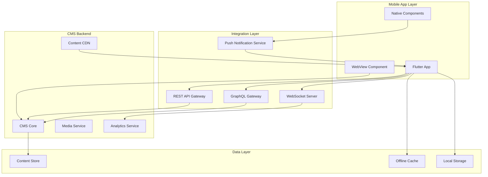

# Mobile App Integration Strategy for Enhanced CMS Functionality

## Executive Summary

This document outlines the comprehensive mobile integration strategy for UpCoach's enhanced CMS functionality, covering both Flutter native app integration and responsive web design for CMS interfaces accessed through mobile browsers.

## 1. Mobile Integration Architecture

### 1.1 System Architecture Overview



### 1.2 Flutter App Architecture Layers

```
lib/
├── core/
│   ├── cms/
│   │   ├── models/
│   │   │   ├── cms_content.dart
│   │   │   ├── cms_workflow.dart
│   │   │   ├── cms_analytics.dart
│   │   │   └── cms_media.dart
│   │   ├── services/
│   │   │   ├── cms_api_service.dart
│   │   │   ├── cms_sync_service.dart
│   │   │   ├── cms_cache_service.dart
│   │   │   └── cms_notification_service.dart
│   │   └── providers/
│   │       ├── cms_content_provider.dart
│   │       └── cms_workflow_provider.dart
│   ├── push_notifications/
│   │   ├── push_notification_service.dart
│   │   ├── notification_handler.dart
│   │   └── notification_models.dart
│   └── webview/
│       ├── webview_controller.dart
│       ├── webview_bridge.dart
│       └── javascript_interface.dart
├── features/
│   ├── cms_content/
│   │   ├── screens/
│   │   │   ├── content_library_screen.dart
│   │   │   ├── content_detail_screen.dart
│   │   │   └── content_editor_screen.dart
│   │   └── widgets/
│   │       ├── content_card.dart
│   │       ├── content_preview.dart
│   │       └── offline_indicator.dart
│   ├── cms_workflow/
│   │   ├── screens/
│   │   │   ├── workflow_dashboard_screen.dart
│   │   │   ├── approval_queue_screen.dart
│   │   │   └── workflow_detail_screen.dart
│   │   └── widgets/
│   │       ├── workflow_card.dart
│   │       ├── approval_action_sheet.dart
│   │       └── workflow_timeline.dart
│   └── cms_analytics/
│       ├── screens/
│       │   ├── analytics_dashboard_screen.dart
│       │   └── content_metrics_screen.dart
│       └── widgets/
│           ├── metric_card.dart
│           ├── engagement_chart.dart
│           └── performance_indicator.dart
└── shared/
    └── cms/
        ├── widgets/
        │   ├── responsive_cms_layout.dart
        │   ├── mobile_drag_drop.dart
        │   └── touch_optimized_editor.dart
        └── utils/
            ├── cms_formatter.dart
            └── cms_validator.dart
```

## 2. Responsive Design Specifications

### 2.1 Breakpoint Strategy

```dart
class CMSBreakpoints {
  static const double mobileSmall = 320;   // Small phones
  static const double mobileMedium = 375;  // Standard phones
  static const double mobileLarge = 414;   // Large phones
  static const double tablet = 768;        // Tablets
  static const double desktop = 1024;      // Desktop starts

  static bool isMobileSmall(BuildContext context) =>
    MediaQuery.of(context).size.width <= mobileSmall;

  static bool isMobile(BuildContext context) =>
    MediaQuery.of(context).size.width < tablet;

  static bool isTablet(BuildContext context) =>
    MediaQuery.of(context).size.width >= tablet &&
    MediaQuery.of(context).size.width < desktop;
}
```

### 2.2 Mobile-Optimized CMS Components

```dart
// Touch-optimized drag and drop interface
class MobileDragDropInterface extends StatefulWidget {
  final List<CMSBlock> blocks;
  final Function(List<CMSBlock>) onReorder;

  @override
  Widget build(BuildContext context) {
    return ReorderableListView.builder(
      buildDefaultDragHandles: false,
      itemCount: blocks.length,
      onReorder: (oldIndex, newIndex) {
        // Haptic feedback for drag operations
        HapticFeedback.mediumImpact();
        // Handle reordering logic
      },
      itemBuilder: (context, index) {
        return ReorderableDragStartListener(
          key: ValueKey(blocks[index].id),
          index: index,
          child: CMSBlockCard(
            block: blocks[index],
            onLongPress: () => HapticFeedback.selectionClick(),
          ),
        );
      },
    );
  }
}

// Mobile-optimized rich text editor
class MobileRichTextEditor extends StatelessWidget {
  @override
  Widget build(BuildContext context) {
    return Column(
      children: [
        // Toolbar positioned for thumb reach
        Positioned(
          bottom: MediaQuery.of(context).viewInsets.bottom + 8,
          child: EditorToolbar(
            compact: true,
            actions: [
              ToolbarAction.bold,
              ToolbarAction.italic,
              ToolbarAction.link,
              ToolbarAction.image,
              ToolbarAction.more, // Additional options in bottom sheet
            ],
          ),
        ),
        // Text editor with mobile-optimized input
        Expanded(
          child: TextField(
            maxLines: null,
            textCapitalization: TextCapitalization.sentences,
            keyboardType: TextInputType.multiline,
            textInputAction: TextInputAction.newline,
          ),
        ),
      ],
    );
  }
}
```

## 3. Flutter App Integration Points

### 3.1 CMS Content Service Integration

```dart
class CMSContentService {
  final ApiService _apiService;
  final CMSCacheService _cacheService;
  final OfflineSyncService _syncService;

  // Fetch content with offline support
  Future<List<CMSContent>> getContent({
    required ContentType type,
    Map<String, dynamic>? filters,
    bool forceRefresh = false,
  }) async {
    try {
      // Check cache first
      if (!forceRefresh) {
        final cached = await _cacheService.getContent(type, filters);
        if (cached != null && cached.isNotEmpty) {
          return cached;
        }
      }

      // Fetch from API
      final response = await _apiService.get(
        '/api/cms/content',
        queryParameters: {
          'type': type.toString(),
          ...?filters,
        },
      );

      final content = (response.data['data'] as List)
          .map((json) => CMSContent.fromJson(json))
          .toList();

      // Cache for offline use
      await _cacheService.saveContent(type, content);

      return content;
    } catch (e) {
      // Fallback to cached content if offline
      if (!await _syncService.isOnline()) {
        final cached = await _cacheService.getContent(type, filters);
        if (cached != null) return cached;
      }
      throw CMSException('Failed to fetch content: $e');
    }
  }

  // Submit content with offline queuing
  Future<void> submitContent(CMSContent content) async {
    try {
      if (await _syncService.isOnline()) {
        await _apiService.post('/api/cms/content', data: content.toJson());
      } else {
        // Queue for later sync
        await _syncService.addPendingOperation(
          type: 'create',
          entity: 'cms_content',
          data: content.toJson(),
        );
      }
    } catch (e) {
      throw CMSException('Failed to submit content: $e');
    }
  }
}
```

### 3.2 Push Notification Integration

```dart
class CMSNotificationService {
  final FirebaseMessaging _messaging;
  final FlutterLocalNotificationsPlugin _localNotifications;
  final StreamController<CMSNotification> _notificationController;

  Future<void> initialize() async {
    // Request permissions
    final settings = await _messaging.requestPermission(
      alert: true,
      badge: true,
      sound: true,
      provisional: false,
    );

    if (settings.authorizationStatus == AuthorizationStatus.authorized) {
      // Get FCM token
      final token = await _messaging.getToken();
      await _registerDeviceToken(token);

      // Handle foreground messages
      FirebaseMessaging.onMessage.listen(_handleForegroundMessage);

      // Handle background messages
      FirebaseMessaging.onBackgroundMessage(_handleBackgroundMessage);

      // Handle notification taps
      FirebaseMessaging.onMessageOpenedApp.listen(_handleNotificationTap);
    }
  }

  void _handleForegroundMessage(RemoteMessage message) {
    final notification = CMSNotification.fromMessage(message);

    switch (notification.type) {
      case NotificationType.workflowApproval:
        _showApprovalNotification(notification);
        break;
      case NotificationType.contentPublished:
        _showContentNotification(notification);
        break;
      case NotificationType.analyticsAlert:
        _showAnalyticsNotification(notification);
        break;
      default:
        _showGenericNotification(notification);
    }

    _notificationController.add(notification);
  }

  Future<void> _showApprovalNotification(CMSNotification notification) async {
    await _localNotifications.show(
      notification.id.hashCode,
      notification.title,
      notification.body,
      NotificationDetails(
        android: AndroidNotificationDetails(
          'cms_workflow',
          'CMS Workflow',
          channelDescription: 'CMS workflow approvals',
          importance: Importance.high,
          priority: Priority.high,
          actions: [
            AndroidNotificationAction('approve', 'Approve'),
            AndroidNotificationAction('reject', 'Reject'),
            AndroidNotificationAction('view', 'View Details'),
          ],
        ),
        iOS: DarwinNotificationDetails(
          presentAlert: true,
          presentBadge: true,
          presentSound: true,
          categoryIdentifier: 'CMS_WORKFLOW',
        ),
      ),
      payload: notification.toJson(),
    );
  }
}
```

### 3.3 WebView Integration for CMS Admin

```dart
class CMSWebViewController {
  final WebViewController _webViewController;
  final JavaScriptChannel _jsChannel;

  CMSWebViewController() {
    _webViewController = WebViewController()
      ..setJavaScriptMode(JavaScriptMode.unrestricted)
      ..addJavaScriptChannel(_createJavaScriptChannel())
      ..setNavigationDelegate(_createNavigationDelegate())
      ..setUserAgent(_getMobileUserAgent());
  }

  JavaScriptChannel _createJavaScriptChannel() {
    return JavaScriptChannel(
      name: 'FlutterCMS',
      onMessageReceived: (JavaScriptMessage message) {
        final data = jsonDecode(message.message);
        _handleWebViewMessage(data);
      },
    );
  }

  void _handleWebViewMessage(Map<String, dynamic> data) {
    switch (data['action']) {
      case 'requestAuth':
        _provideAuthToken();
        break;
      case 'openNativeEditor':
        _openNativeEditor(data['payload']);
        break;
      case 'shareContent':
        _shareContent(data['payload']);
        break;
      case 'downloadMedia':
        _downloadMedia(data['payload']);
        break;
    }
  }

  Future<void> _provideAuthToken() async {
    final token = await AuthService().getAccessToken();
    await _webViewController.runJavaScript(
      'window.setAuthToken("$token")'
    );
  }

  // Bridge between web CMS and native features
  Future<void> injectNativeBridge() async {
    await _webViewController.runJavaScript('''
      window.nativeBridge = {
        isAvailable: true,
        platform: 'flutter',
        capabilities: {
          camera: true,
          storage: true,
          notifications: true,
          biometrics: true
        },

        // Native file picker
        pickFile: function(options) {
          FlutterCMS.postMessage(JSON.stringify({
            action: 'pickFile',
            payload: options
          }));
        },

        // Native camera
        takePhoto: function() {
          FlutterCMS.postMessage(JSON.stringify({
            action: 'takePhoto'
          }));
        },

        // Native share
        share: function(content) {
          FlutterCMS.postMessage(JSON.stringify({
            action: 'shareContent',
            payload: content
          }));
        }
      };
    ''');
  }
}
```

## 4. Mobile-Specific User Experience Flows

### 4.1 Content Creation Flow

```dart
class MobileContentCreationFlow {
  static const List<ContentCreationStep> steps = [
    ContentCreationStep(
      title: 'Choose Type',
      description: 'Select content type',
      widget: ContentTypeSelector(),
    ),
    ContentCreationStep(
      title: 'Add Content',
      description: 'Write your content',
      widget: MobileRichTextEditor(),
    ),
    ContentCreationStep(
      title: 'Add Media',
      description: 'Attach images or videos',
      widget: MediaUploader(),
    ),
    ContentCreationStep(
      title: 'Settings',
      description: 'Configure publishing options',
      widget: PublishingSettings(),
    ),
    ContentCreationStep(
      title: 'Preview',
      description: 'Review before publishing',
      widget: ContentPreview(),
    ),
  ];

  Widget buildFlow() {
    return PageView.builder(
      itemCount: steps.length,
      itemBuilder: (context, index) {
        return ContentCreationPage(
          step: steps[index],
          currentStep: index + 1,
          totalSteps: steps.length,
          onNext: () => _moveToNext(index),
          onBack: () => _moveBack(index),
        );
      },
    );
  }
}
```

### 4.2 Workflow Approval Flow

```dart
class WorkflowApprovalFlow extends StatelessWidget {
  final WorkflowItem item;

  @override
  Widget build(BuildContext context) {
    return DraggableScrollableSheet(
      initialChildSize: 0.7,
      minChildSize: 0.5,
      maxChildSize: 0.95,
      builder: (context, scrollController) {
        return Container(
          decoration: BoxDecoration(
            color: Theme.of(context).scaffoldBackgroundColor,
            borderRadius: BorderRadius.vertical(top: Radius.circular(20)),
          ),
          child: Column(
            children: [
              // Drag handle
              Container(
                width: 40,
                height: 5,
                margin: EdgeInsets.symmetric(vertical: 12),
                decoration: BoxDecoration(
                  color: Colors.grey[300],
                  borderRadius: BorderRadius.circular(2.5),
                ),
              ),

              // Content preview
              Expanded(
                child: SingleChildScrollView(
                  controller: scrollController,
                  child: Column(
                    children: [
                      WorkflowHeader(item: item),
                      ContentPreview(content: item.content),
                      VersionComparison(
                        current: item.currentVersion,
                        proposed: item.proposedVersion,
                      ),
                      CommentSection(comments: item.comments),
                    ],
                  ),
                ),
              ),

              // Action buttons
              SafeArea(
                child: Padding(
                  padding: EdgeInsets.all(16),
                  child: Row(
                    children: [
                      Expanded(
                        child: OutlinedButton.icon(
                          onPressed: () => _reject(context),
                          icon: Icon(Icons.close),
                          label: Text('Reject'),
                        ),
                      ),
                      SizedBox(width: 16),
                      Expanded(
                        child: ElevatedButton.icon(
                          onPressed: () => _approve(context),
                          icon: Icon(Icons.check),
                          label: Text('Approve'),
                        ),
                      ),
                    ],
                  ),
                ),
              ),
            ],
          ),
        );
      },
    );
  }
}
```

## 5. Performance Optimization

### 5.1 Image Optimization

```dart
class CMSImageOptimizer {
  static const Map<DeviceType, ImageConfig> configs = {
    DeviceType.mobileSmall: ImageConfig(width: 320, quality: 70),
    DeviceType.mobileMedium: ImageConfig(width: 375, quality: 75),
    DeviceType.mobileLarge: ImageConfig(width: 414, quality: 80),
    DeviceType.tablet: ImageConfig(width: 768, quality: 85),
  };

  static String getOptimizedUrl(String originalUrl, BuildContext context) {
    final deviceType = _getDeviceType(context);
    final config = configs[deviceType]!;

    // Add CDN transformation parameters
    return '$originalUrl?w=${config.width}&q=${config.quality}&auto=format';
  }

  static Future<File> compressForUpload(File image) async {
    final result = await FlutterImageCompress.compressAndGetFile(
      image.absolute.path,
      '${image.parent.path}/compressed_${DateTime.now().millisecondsSinceEpoch}.jpg',
      quality: 80,
      minWidth: 1080,
      minHeight: 1080,
    );
    return File(result!.path);
  }
}
```

### 5.2 Content Caching Strategy

```dart
class CMSCacheManager {
  static const Duration contentCacheDuration = Duration(hours: 24);
  static const Duration mediaCacheDuration = Duration(days: 7);
  static const int maxCacheSize = 100 * 1024 * 1024; // 100MB

  final Box<CMSContent> _contentBox;
  final DefaultCacheManager _mediaCache;

  Future<void> preloadContent(List<String> contentIds) async {
    // Batch fetch and cache content
    final futures = contentIds.map((id) => _fetchAndCache(id));
    await Future.wait(futures);
  }

  Future<void> clearOldCache() async {
    final now = DateTime.now();

    // Clear expired content
    final expiredKeys = _contentBox.keys.where((key) {
      final content = _contentBox.get(key);
      return content != null &&
             now.difference(content.cachedAt) > contentCacheDuration;
    }).toList();

    await _contentBox.deleteAll(expiredKeys);

    // Clear media cache if size exceeded
    final cacheSize = await _mediaCache.getSize();
    if (cacheSize > maxCacheSize) {
      await _mediaCache.emptyCache();
    }
  }
}
```

### 5.3 Lazy Loading Implementation

```dart
class CMSContentList extends StatelessWidget {
  final ScrollController _scrollController = ScrollController();
  final CMSContentProvider provider;

  @override
  Widget build(BuildContext context) {
    return NotificationListener<ScrollNotification>(
      onNotification: (scrollInfo) {
        if (scrollInfo.metrics.pixels ==
            scrollInfo.metrics.maxScrollExtent) {
          provider.loadMore();
        }
        return false;
      },
      child: RefreshIndicator(
        onRefresh: provider.refresh,
        child: ListView.builder(
          controller: _scrollController,
          itemCount: provider.items.length + 1,
          itemBuilder: (context, index) {
            if (index == provider.items.length) {
              return provider.isLoadingMore
                  ? LoadingIndicator()
                  : SizedBox.shrink();
            }

            return CMSContentCard(
              content: provider.items[index],
              onTap: () => _openDetail(context, provider.items[index]),
            );
          },
        ),
      ),
    );
  }
}
```

## 6. Push Notification Strategy

### 6.1 Notification Categories

```dart
enum CMSNotificationCategory {
  workflowApproval(
    channelId: 'workflow_approval',
    importance: NotificationImportance.high,
    actions: ['approve', 'reject', 'view'],
  ),
  contentPublished(
    channelId: 'content_published',
    importance: NotificationImportance.default_,
    actions: ['view', 'share'],
  ),
  analyticsAlert(
    channelId: 'analytics_alert',
    importance: NotificationImportance.default_,
    actions: ['view_dashboard'],
  ),
  systemUpdate(
    channelId: 'system_update',
    importance: NotificationImportance.low,
    actions: ['dismiss'],
  );

  final String channelId;
  final NotificationImportance importance;
  final List<String> actions;

  const CMSNotificationCategory({
    required this.channelId,
    required this.importance,
    required this.actions,
  });
}
```

### 6.2 Notification Handling

```dart
class CMSNotificationHandler {
  Future<void> handleNotificationAction(
    String action,
    Map<String, dynamic> payload,
  ) async {
    switch (action) {
      case 'approve':
        await _handleApproval(payload['workflowId'], true);
        break;
      case 'reject':
        await _handleApproval(payload['workflowId'], false);
        break;
      case 'view':
        await _navigateToContent(payload['contentId']);
        break;
      case 'share':
        await _shareContent(payload['contentId']);
        break;
      case 'view_dashboard':
        await _navigateToAnalytics();
        break;
    }
  }

  Future<void> _handleApproval(String workflowId, bool approved) async {
    try {
      await CMSService().approveWorkflow(
        workflowId: workflowId,
        approved: approved,
        comments: approved ? 'Approved via mobile' : 'Rejected via mobile',
      );

      // Show success feedback
      await LocalNotifications.show(
        title: approved ? 'Approved' : 'Rejected',
        body: 'Workflow action completed successfully',
      );
    } catch (e) {
      // Show error feedback
      await LocalNotifications.show(
        title: 'Action Failed',
        body: 'Could not complete workflow action. Please try again.',
      );
    }
  }
}
```

## 7. Mobile Analytics Dashboard

### 7.1 Dashboard Layout

```dart
class MobileAnalyticsDashboard extends StatelessWidget {
  @override
  Widget build(BuildContext context) {
    return DefaultTabController(
      length: 3,
      child: Scaffold(
        appBar: AppBar(
          title: Text('Analytics'),
          bottom: TabBar(
            tabs: [
              Tab(text: 'Overview'),
              Tab(text: 'Content'),
              Tab(text: 'Engagement'),
            ],
          ),
        ),
        body: TabBarView(
          children: [
            OverviewTab(),
            ContentMetricsTab(),
            EngagementTab(),
          ],
        ),
      ),
    );
  }
}

class OverviewTab extends StatelessWidget {
  @override
  Widget build(BuildContext context) {
    return SingleChildScrollView(
      padding: EdgeInsets.all(16),
      child: Column(
        children: [
          // Key metrics cards
          GridView.count(
            crossAxisCount: 2,
            shrinkWrap: true,
            physics: NeverScrollableScrollPhysics(),
            mainAxisSpacing: 12,
            crossAxisSpacing: 12,
            childAspectRatio: 1.5,
            children: [
              MetricCard(
                title: 'Total Views',
                value: '12.5K',
                change: '+15%',
                icon: Icons.visibility,
              ),
              MetricCard(
                title: 'Engagement',
                value: '68%',
                change: '+5%',
                icon: Icons.thumb_up,
              ),
              MetricCard(
                title: 'Shares',
                value: '432',
                change: '+22%',
                icon: Icons.share,
              ),
              MetricCard(
                title: 'Avg. Time',
                value: '3:42',
                change: '-8%',
                icon: Icons.timer,
              ),
            ],
          ),

          SizedBox(height: 24),

          // Engagement chart
          Container(
            height: 200,
            child: EngagementChart(
              data: mockEngagementData,
              period: ChartPeriod.week,
            ),
          ),

          SizedBox(height: 24),

          // Top performing content
          Card(
            child: Column(
              crossAxisAlignment: CrossAxisAlignment.start,
              children: [
                Padding(
                  padding: EdgeInsets.all(16),
                  child: Text(
                    'Top Content',
                    style: Theme.of(context).textTheme.titleLarge,
                  ),
                ),
                ListView.separated(
                  shrinkWrap: true,
                  physics: NeverScrollableScrollPhysics(),
                  itemCount: 5,
                  separatorBuilder: (_, __) => Divider(height: 1),
                  itemBuilder: (context, index) {
                    return ContentPerformanceItem(
                      title: 'Article Title ${index + 1}',
                      views: 2500 - (index * 300),
                      engagement: 75 - (index * 5),
                    );
                  },
                ),
              ],
            ),
          ),
        ],
      ),
    );
  }
}
```

### 7.2 Mobile-Optimized Charts

```dart
class MobileOptimizedChart extends StatelessWidget {
  final ChartData data;
  final ChartType type;

  @override
  Widget build(BuildContext context) {
    return GestureDetector(
      onTap: () => _showFullScreenChart(context),
      child: Container(
        height: 180,
        padding: EdgeInsets.all(8),
        child: _buildCompactChart(),
      ),
    );
  }

  Widget _buildCompactChart() {
    // Simplified chart for mobile view
    return LineChart(
      LineChartData(
        gridData: FlGridData(show: false),
        titlesData: FlTitlesData(
          leftTitles: AxisTitles(
            sideTitles: SideTitles(showTitles: false),
          ),
          bottomTitles: AxisTitles(
            sideTitles: SideTitles(
              showTitles: true,
              getTitlesWidget: (value, meta) {
                // Show only every other label on mobile
                if (value.toInt() % 2 == 0) {
                  return Text(
                    _getLabel(value),
                    style: TextStyle(fontSize: 10),
                  );
                }
                return SizedBox.shrink();
              },
            ),
          ),
        ),
        borderData: FlBorderData(show: false),
        lineBarsData: [
          LineChartBarData(
            spots: data.points,
            isCurved: true,
            color: Theme.of(context).primaryColor,
            barWidth: 2,
            dotData: FlDotData(show: false),
            belowBarData: BarAreaData(
              show: true,
              color: Theme.of(context).primaryColor.withOpacity(0.1),
            ),
          ),
        ],
      ),
    );
  }

  void _showFullScreenChart(BuildContext context) {
    Navigator.push(
      context,
      MaterialPageRoute(
        builder: (context) => FullScreenChart(
          data: data,
          type: type,
        ),
      ),
    );
  }
}
```

## 8. Offline Capability Implementation

### 8.1 Offline Content Management

```dart
class OfflineCMSManager {
  final Database _database;
  final FileStorage _fileStorage;

  Future<void> downloadContentForOffline(String contentId) async {
    try {
      // Fetch content from API
      final content = await CMSService().getContent(contentId);

      // Download media files
      final mediaFiles = await _downloadMediaFiles(content.media);

      // Store in local database
      await _database.insert('offline_content', {
        'id': content.id,
        'type': content.type.toString(),
        'title': content.title,
        'body': content.body,
        'media': jsonEncode(mediaFiles),
        'metadata': jsonEncode(content.metadata),
        'downloaded_at': DateTime.now().toIso8601String(),
      });

      // Update UI
      OfflineContentProvider().notifyContentDownloaded(contentId);

    } catch (e) {
      throw OfflineException('Failed to download content: $e');
    }
  }

  Future<List<String>> _downloadMediaFiles(List<MediaItem> media) async {
    final localPaths = <String>[];

    for (final item in media) {
      final file = await DefaultCacheManager().getSingleFile(item.url);
      final localPath = await _fileStorage.saveFile(
        file,
        'cms_media/${item.id}${item.extension}',
      );
      localPaths.add(localPath);
    }

    return localPaths;
  }

  Future<CMSContent?> getOfflineContent(String contentId) async {
    final results = await _database.query(
      'offline_content',
      where: 'id = ?',
      whereArgs: [contentId],
    );

    if (results.isEmpty) return null;

    final row = results.first;
    return CMSContent(
      id: row['id'] as String,
      type: ContentType.values.firstWhere(
        (e) => e.toString() == row['type'],
      ),
      title: row['title'] as String,
      body: row['body'] as String,
      media: (jsonDecode(row['media'] as String) as List)
          .map((path) => MediaItem.local(path))
          .toList(),
      metadata: jsonDecode(row['metadata'] as String),
    );
  }
}
```

### 8.2 Sync Queue Management

```dart
class CMSSyncQueue {
  final Queue<SyncOperation> _queue = Queue();
  final StreamController<SyncStatus> _statusController;
  Timer? _processTimer;

  void addOperation(SyncOperation operation) {
    _queue.add(operation);
    _startProcessing();
  }

  void _startProcessing() {
    _processTimer?.cancel();
    _processTimer = Timer.periodic(Duration(seconds: 30), (_) {
      _processQueue();
    });
  }

  Future<void> _processQueue() async {
    if (_queue.isEmpty) return;

    final connectivity = await Connectivity().checkConnectivity();
    if (connectivity == ConnectivityResult.none) return;

    while (_queue.isNotEmpty) {
      final operation = _queue.removeFirst();

      try {
        await _executeOperation(operation);
        _statusController.add(SyncStatus.success);
      } catch (e) {
        // Re-queue failed operations
        _queue.addLast(operation.copyWith(
          retryCount: operation.retryCount + 1,
        ));

        if (operation.retryCount >= 3) {
          _statusController.add(SyncStatus.failed);
          _queue.remove(operation);
        }
      }
    }
  }
}
```

## 9. Security Considerations

### 9.1 Content Encryption

```dart
class CMSSecurityManager {
  static const String _encryptionKey = 'cms_encryption_key';

  Future<String> encryptContent(String content) async {
    final key = await _getEncryptionKey();
    final encrypter = Encrypter(AES(key));
    final iv = IV.fromSecureRandom(16);

    final encrypted = encrypter.encrypt(content, iv: iv);
    return '${iv.base64}:${encrypted.base64}';
  }

  Future<String> decryptContent(String encryptedContent) async {
    final parts = encryptedContent.split(':');
    if (parts.length != 2) throw SecurityException('Invalid encrypted content');

    final key = await _getEncryptionKey();
    final encrypter = Encrypter(AES(key));
    final iv = IV.fromBase64(parts[0]);
    final encrypted = Encrypted.fromBase64(parts[1]);

    return encrypter.decrypt(encrypted, iv: iv);
  }

  Future<Key> _getEncryptionKey() async {
    const storage = FlutterSecureStorage();
    String? keyString = await storage.read(key: _encryptionKey);

    if (keyString == null) {
      // Generate new key
      final key = Key.fromSecureRandom(32);
      await storage.write(key: _encryptionKey, value: key.base64);
      return key;
    }

    return Key.fromBase64(keyString);
  }
}
```

### 9.2 Authentication Bridge

```dart
class CMSAuthBridge {
  Future<Map<String, String>> getAuthHeaders() async {
    final token = await AuthService().getAccessToken();
    final deviceId = await DeviceInfo().getDeviceId();

    return {
      'Authorization': 'Bearer $token',
      'X-Device-Id': deviceId,
      'X-Platform': Platform.operatingSystem,
      'X-App-Version': PackageInfo().version,
    };
  }

  Future<void> refreshTokenIfNeeded() async {
    final expiresAt = await AuthService().getTokenExpiry();
    final now = DateTime.now();

    if (expiresAt.difference(now).inMinutes < 5) {
      await AuthService().refreshToken();
    }
  }
}
```

## 10. Testing Strategy

### 10.1 Widget Tests

```dart
void main() {
  group('CMS Content Card Tests', () {
    testWidgets('displays content correctly', (tester) async {
      final content = CMSContent(
        id: '1',
        title: 'Test Content',
        summary: 'Test Summary',
        thumbnail: 'https://example.com/image.jpg',
      );

      await tester.pumpWidget(
        MaterialApp(
          home: Scaffold(
            body: CMSContentCard(content: content),
          ),
        ),
      );

      expect(find.text('Test Content'), findsOneWidget);
      expect(find.text('Test Summary'), findsOneWidget);
      expect(find.byType(CachedNetworkImage), findsOneWidget);
    });

    testWidgets('handles tap correctly', (tester) async {
      bool tapped = false;
      final content = CMSContent(id: '1', title: 'Test');

      await tester.pumpWidget(
        MaterialApp(
          home: Scaffold(
            body: CMSContentCard(
              content: content,
              onTap: () => tapped = true,
            ),
          ),
        ),
      );

      await tester.tap(find.byType(CMSContentCard));
      expect(tapped, isTrue);
    });
  });
}
```

### 10.2 Integration Tests

```dart
void main() {
  IntegrationTestWidgetsFlutterBinding.ensureInitialized();

  group('CMS Flow Integration Tests', () {
    testWidgets('complete content creation flow', (tester) async {
      app.main();
      await tester.pumpAndSettle();

      // Navigate to CMS
      await tester.tap(find.byIcon(Icons.add));
      await tester.pumpAndSettle();

      // Select content type
      await tester.tap(find.text('Article'));
      await tester.pumpAndSettle();

      // Enter content
      await tester.enterText(
        find.byType(TextField).first,
        'Test Article Title',
      );
      await tester.enterText(
        find.byType(TextField).last,
        'Test article content body',
      );

      // Add media
      await tester.tap(find.byIcon(Icons.add_photo_alternate));
      await tester.pumpAndSettle();

      // Publish
      await tester.tap(find.text('Publish'));
      await tester.pumpAndSettle();

      // Verify success
      expect(find.text('Content published successfully'), findsOneWidget);
    });
  });
}
```

## 11. Deployment Considerations

### 11.1 Build Configuration

```yaml
# pubspec.yaml additions for CMS features
dependencies:
  # CMS specific packages
  webview_flutter: ^4.4.2
  flutter_quill: ^7.4.16
  drag_and_drop_lists: ^0.3.3
  fl_chart: ^0.63.0

  # Enhanced offline support
  drift: ^2.13.0
  drift_sqflite: ^2.0.1

  # Background processing
  workmanager: ^0.5.2

  # Advanced notifications
  awesome_notifications_fcm: ^0.7.4
```

### 11.2 Platform-Specific Configuration

```xml
<!-- Android: AndroidManifest.xml -->
<uses-permission android:name="android.permission.RECEIVE_BOOT_COMPLETED"/>
<uses-permission android:name="android.permission.WAKE_LOCK"/>

<service
    android:name="io.flutter.plugins.firebase.messaging.FlutterFirebaseMessagingService"
    android:exported="false">
    <intent-filter>
        <action android:name="com.google.firebase.MESSAGING_EVENT"/>
    </intent-filter>
</service>

<!-- iOS: Info.plist -->
<key>UIBackgroundModes</key>
<array>
    <string>fetch</string>
    <string>remote-notification</string>
    <string>processing</string>
</array>
```

## 12. Performance Metrics & Monitoring

### 12.1 Key Performance Indicators

```dart
class CMSPerformanceMonitor {
  static void trackContentLoad(String contentId, Duration loadTime) {
    Analytics.logEvent('cms_content_load', {
      'content_id': contentId,
      'load_time_ms': loadTime.inMilliseconds,
      'network_type': _getCurrentNetworkType(),
      'cache_hit': loadTime.inMilliseconds < 100,
    });
  }

  static void trackUserAction(CMSAction action) {
    Analytics.logEvent('cms_user_action', {
      'action': action.name,
      'timestamp': DateTime.now().toIso8601String(),
      'screen': _getCurrentScreen(),
    });
  }

  static void trackError(String error, StackTrace? stackTrace) {
    Crashlytics.recordError(
      error,
      stackTrace,
      reason: 'CMS Error',
      information: [
        'platform': Platform.operatingSystem,
        'version': PackageInfo().version,
        'network': _getCurrentNetworkType(),
      ],
    );
  }
}
```

## Conclusion

This comprehensive mobile integration strategy ensures seamless CMS functionality across the UpCoach Flutter application. The architecture prioritizes:

1. **Performance**: Optimized for mobile networks and devices
2. **Offline Capability**: Full content access without connectivity
3. **User Experience**: Native mobile patterns and interactions
4. **Security**: End-to-end encryption and secure authentication
5. **Scalability**: Modular architecture supporting future growth

The implementation provides coaches and users with powerful CMS capabilities while maintaining the native mobile experience they expect.